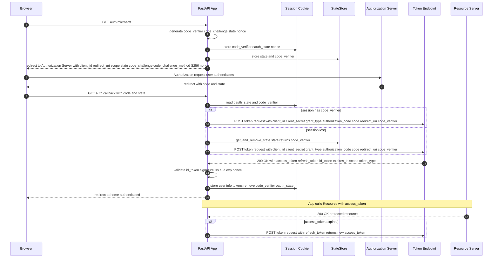

# OAuth using OIDC Authentication with PKCE for a Public and Private Client

                                                 +-------------------+
                                                 |   Authz Server    |
       +--------+                                | +---------------+ |
       |        |--(A)- Authorization Request ---->|               | |
       |        |       + t(code_verifier), t_m  | | Authorization | |
       |        |                                | |    Endpoint   | |
       |        |<-(B)---- Authorization Code -----|               | |
       |        |                                | +---------------+ |
       | Client |                                |                   |
       |        |                                | +---------------+ |
       |        |--(C)-- Access Token Request ---->|               | |
       |        |          + code_verifier       | |    Token      | |
       |        |                                | |   Endpoint    | |
       |        |<-(D)------ Access Token ---------|               | |
       +--------+                                | +---------------+ |
                                                 +-------------------+

- *Request along with the transformation method "t_m"*
- https://datatracker.ietf.org/doc/html/rfc7636

## Considerations before starting: 
- [**What you need from Azure Entra ID?**](#0-what-you-need-from-azure-entra-id)
- [**What functionality does this app offer?**](#1-what-functionality-does-this-app-offer)
    - [Authentication & Authorization](#a-authentication--authorization)
    - [Session Security](#b-session-security)
    - [Transport & Browser Security Headers](#c-transport--browser-security-headers)
    - [Rate Limiting & DoS Protection](#d-rate-limiting--dos-protection)
    - [Additional Application Security](#e-additional-application-security)
- [**Public Client** vs. **Private Client**](#2-public-vs-private-app)
- [**Multi-tenant** vs. **Single-tenant**](#3-tenant-in-azure-entra-id)
- [**Code vs. Tokens**](#8)
- [**Access tokens** vs **ID tokens**](#4)
- [**Implicit flows** vs. **Hybrid flows**](#5)
- [**Platforms** & **OAuth flow restrictions**](#6)
    - **SPA**: Must use browser-based CORS requests (JavaScript fetch/XMLHttpRequest)
    - **Mobile/Desktop** (PublicClient): Allows server-side token exchange with PKCE
    - **Web**: Requires client authentication (secret/certificate)
 - [**How to configure?**](#7)
     - **Private/Confidential server-side client**
     - **Public server-side client**
 - Introspection endpoints
 - [**Dictionary of Codes and Tokens**](#9-dictionary-of-codes-and-tokens)
     - [code_verifier](#1-code_verifier)
     - [code_challenge](#2-code_challenge-s256)
     - [state](#3-state)
     - [nonce](#4-nonce)
     - [Authorization Code](#5-authorization-code-code--returned-by-authorization-server)
     - [Access Token](#6-access-token--returned-by-token-endpoint)
     - [Refresh Token](#7-refresh-token--included-in-token-response)
     - [ID Token](#8-id-token-id_token--openid-connect-identity-token)
     - [Refresh Token](#9-access-token)
     - [Session Cookie](#10-refresh-token-format)
     - [JWKS](#12-jwks-json-web-key-set--public-signing-keys)
 - [**How to add a new features?**](#11)
 - **Bearer token**
 - **Traditional Cookie-Based Auth** vs **Modern Token Based Auth**
   - **Cookie-based auth** relies on **server-side sessions** and cookies handled by the browser.
   - **Token-based auth** relies on **stateless tokens (JWTs)** that the client must attach explicitly to requests.
- **LocalStorage** vs. **Session** vs. **Cookie**
- **Should JWT Token be stored in a cookie, header or body?**
 
# 0. What you need from Azure Entra ID?
- **Public Client (PKCE only)**
  - `Tenant ID` (or domain)
  - `Client ID`
  - `Redirect URI(s)` (registered as public client)
  - `Scopes` (openid profile offline_access + APIs)
  - `Code challenge/verifier` (runtime-generated, not from Entra)

👉 **No client secret**.

- **Confidential Client (Secret or Certificate)**
  - `Tenant ID` (or domain)
  - `Client ID`
  - `Redirect URI(s)`
  - `Scopes`
  - `Client secret` or `certificate` (securely stored)
  - (Optional) `PKCE` support - `Code challenge/verifier`

👉 **PKCE + secret/cert = strongest protection.**

# 1. What functionality does this app offer?

### A. Authentication & Authorization
- **Authorization Code Flow with PKCE (S256)**: Secure OAuth2 flow for SPAs/native apps that prevents stolen authorization codes from being reused.
- **PKCE (Proof Key for Code Exchange)**: Binds the authorization code to the client via a code_verifier + hashed code_challenge. Prevents interception attacks.
- **JWT validation**: Verifies token integrity and claims (exp, aud, iss, etc.). Ensures tokens are authentic and not expired/misused.
- **State parameter**: Random value sent in requests to protect against CSRF attacks.
- **Tokens**:
    - **Access Token**: Short-lived (1h), grants API access.
    - **ID Token**: Contains user identity claims. Used for authentication.
    - **Refresh Token**: Long-lived, allows refreshing expired access tokens.
    - **Authorization Code**: Short-lived exchange artifact, avoids token leakage.
- **Microsoft Entra ID integration**: Delegates authentication to a trusted Identity Provider.
- **Token exchange** (requests HTTP client): Secure backchannel call to swap authorization code for tokens.

### B. Session Security
- **1-hour session timeout**: Limits exposure from inactive or hijacked sessions.
- **Cookie attributes**:
    - `HttpOnly`: Prevents JS access.
    - `Secure`: Sends only over HTTPS.
    - `SameSite`: Mitigates CSRF.
    - `Path`: Restricts scope.
- **Server-side session storage**: Prevents client tampering with session state.
- **Automatic session cleanup**: Reduces memory leaks and invalid session persistence.
- **Session Recovery Mechanism**: Fallback to in-memory StateStore if persistent storage fails. Ensures availability.
- **Thread-safe session handling**: Locks prevent race conditions on concurrent session updates.
- **Starlette SessionMiddleware**: Provides standardized session management in FastAPI.

### C. Transport & Browser Security Headers
- **Content Security Policy (CSP)**: Restricts allowed sources for scripts/styles. Mitigates XSS.
- **X-Content-Type-Options: nosniff**: Prevents MIME type sniffing. Stops certain injection attacks.
- **X-Frame-Options: DENY/SAMEORIGIN**: Prevents clickjacking via iframes.
- **Strict-Transport-Security (HSTS)**: Enforces HTTPS-only access to the app.
- **Cache-Control**: Prevents sensitive pages from being cached client-side.

### D. Rate Limiting & DoS Protection
- **Request quotas (200/day, 50/hour per IP)**: Controls abusive traffic.
- **Endpoint-specific limits**: Extra protection on authentication endpoints.
- **SlowAPI integration**: Rate limiting middleware for FastAPI.
- **IP-based tracking (get_remote_address)**: Prevents brute force attempts tied to an IP.

### E. Additional Application Security
- **CORS middleware**: Restricts allowed origins for API requests.
- **Trusted Host middleware**: Blocks Host header poisoning attacks.
- **Comprehensive logging**: Debug + security logs to monitor suspicious behavior.
- **Debug endpoints (`/debug-info`)**: Safe environment for troubleshooting (with caution).
- **Health endpoint (`/health`)**: Monitors app status without leaking sensitive data.
- **Custom error handlers (`404`/`500`)**: Prevents leaking stack traces or internals.
- **Secure randomness (secrets, cryptographic entropy)**: Generates unpredictable values for tokens, states, and verifiers.

# 2. Public vs. Private App

### **Public Client**
- An application that **cannot safely store secrets** (e.g., mobile apps, SPAs, CLI tools).
- Uses **PKCE to protect against code interception**.
- Does **not authenticate** with a **client secret**.
- **No secure server-side environment**
- In public clients, all code executes **on devices** you don’t control.
- Unlike a backend server, there’s **no trusted**, **isolated runtime** to protect the secret.

### **Confidential Client (Private)**
- An application that can **safely store secrets** (e.g., server-side apps, daemons).
- Uses **client secret** or **certificate for authentication**.
- Can also use **PKCE as an additional security layer**.

| Aspect                 | Public Client (PKCE only)           | Confidential Client (Secret/Cert + PKCE optional) |
| ---------------------- | ----------------------------------- | ------------------------------------------------- |
| **Secret storage**     | No secret (unsafe environment)      | Secret or certificate securely stored             |
| **PKCE usage**         | Required                            | Optional (but recommended)                        |
| **Security guarantee** | Proof-of-possession (via PKCE) only | Secret-based authentication + optional PKCE       |
| **Use cases**          | Mobile apps, SPAs, CLI tools        | Server-side apps, web APIs, background services   |


# 3. Tenant in Azure Entra ID?

- A tenant is an instance of Microsoft Entra ID that an organization receives when it signs up for Microsoft cloud services (e.g., Microsoft 365, Azure, Dynamics 365).
- It represents an organization and contains users, groups, applications, and subscriptions.

Single-Tenant

Definition: The application is registered and available only to users (and service principals) in one Azure AD tenant (the publisher’s tenant).
Used when an app is meant only for internal use within one organization.

Authentication and authorization happen only against the organization’s tenant.
Real-life Situations:

A company builds an HR management app just for its own employees.

A corporate intranet or dashboard.
- **Multi-Tenant**: The application is registered once in Azure, but can be used by users from multiple Azure AD tenants (organizations).
- Designed for SaaS apps and services that need to authenticate users from different organizations.
- A SaaS company builds a project management tool where each customer (different company) signs in with their own Microsoft 365 accounts.

A third-party CRM app that different businesses subscribe to.

Real-world Analogy

Single-Tenant: Like a company cafeteria — only employees of that company can eat there.

Multi-Tenant: Like a public restaurant — open to anyone, but each customer pays for their own meal and gets their own table (isolation).

| Aspect             | Single-Tenant                          | Multi-Tenant                                                                      |
| ------------------ | -------------------------------------- | --------------------------------------------------------------------------------- |
| **Audience**       | One organization (internal users only) | Multiple organizations (external tenants)                                         |
| **Authentication** | Only users in the publishing tenant    | Users from any Azure AD tenant (with consent)                                     |
| **Deployment**     | Internal LOB applications              | SaaS applications                                                                 |
| **Complexity**     | Simpler to manage                      | Requires handling consent, directory isolation, possibly multi-tenant data models |
| **Security**       | More controlled (single org)           | Broader scope → needs extra governance (conditional access, tenant restrictions)  |

# 4. Access tokens vs. ID tokens

- Access tokens (used for implicit flows) vs. ID tokens (used for implicit and hybrid flows)


# 7. How to configure?

## A. A PUBLIC server-side Client

#### Azure AD Configuration Changes Required

1. Enable Public Client Flows
- In our Azure AD app registration:
- Go to Authentication → Advanced settings
- Set "Allow public client flows" to Yes
This is the crucial setting that tells Azure AD this app can use PKCE without a client secret

2. Verify Platform Configuration
- In Authentication → Platform configurations
- Make sure you have a Mobile/Desktop platform configured
- Add redirect URI: `http://localhost:8080/auth/callback`
- Enable ID tokens checkbox

If we chose Web platform configured (not Mobile/Desktop) - we should have this issue "Tokens issued for the 'Single-Page Application' client-type may only be redeemed via cross-origin requests."
This means Microsoft expects SPA applications to make token requests from the browser using CORS, not from a server-side application. 
Our FastAPI app is making a server-to-server POST request, which Microsoft blocks for SPA platform types.
Since our FastAPI app makes server-side HTTP requests (not browser CORS requests), you need the Mobile/Desktop platform type, which allows public clients to make server-side token requests with PKCE protection.

3. Remove Any Client Secrets (Optional)
- Go to Certificates & secrets
- You can delete any existing client secrets since they won't be used

4. Verify API Permissions

In API permissions, ensure you have:
- `openid`
- `profile`
- `email`
- `offline_access`

0. Initialization
 - **Tenant ID (or domain)** - Used in our authority URLs:
```
https://login.microsoftonline.com/{tenant_id}/oauth2/v2.0/authorize
https://login.microsoftonline.com/{tenant_id}/oauth2/v2.0/token
```
- **Client (Application) ID** - Identifies our app.
- **Redirect URI** Must be registered in the app as a **public client** redirect URI (e.g. `http://localhost:5000/callback` if developing locally).
- **Scopes**
- At minimum: `openid` `profile` `offline_access` `email` + any API scopes (e.g. `api://<resource-app-id>/.default` or `https://graph.microsoft.com/User.Read`).

1. **User visits the app and clicks "login".** The browser makes a request to your FastAPI app (e.g. `/auth/microsoft`).
   
2. Server generates **PKCE** and **state values**. The app (server code) generates:
  - a `code_verifier` (**random secret**),
  - a `code_challenge` (**SHA256** of the verifier),
  - a `state` (CSRF guard).
These values are created **on the server**, **not by the remote authorization server**.
Our App (Server Provider) creates `code verifier` + `challenge`. Generate a random string (`code_verifier`) and its **SHA256-based Base64URL-encoded hash** (`code_challenge`).

3. The server stores **those values in two places**.
  - It stores them in `request.session` (**Starlette session**). Important: with Starlette's default `SessionMiddleware`, **session data is serialized into a cookie** and **sent to the browser** (signed but not encrypted).
  - It also stores {`state` -> `code_verifier`, `timestamp`} in **an in-memory** `StateStore` as a server-side backup.
    
4. Server **builds the authorization URL** and **redirects the user's browser**.
The URL includes
  - `client_id`,
  - `response_type=code`,
  - `redirect_uri`,
  - `scope`,
  - `state`,
  - `code_challenge`, and
  - `code_challenge_method=S256`.
The browser is redirected to **Microsoft’s authorization endpoint**.

```
GET https://login.microsoftonline.com/{tenant}/oauth2/v2.0/authorize
?client_id={client_id}
&response_type=code
&redirect_uri={redirect_uri}
&response_mode=query
&scope={scopes}
&code_challenge={code_challenge}
&code_challenge_method=S256
```

6. **User authenticates & consents at Microsoft**.
Microsoft prompts the user to **sign in/consent**. The authorization server **records the authorization grant**, including the `code_challenge` and `state` **associated with that authorization request**, so it can verify them later when the code is exchanged.

7. **Authorization server redirects the browser** back to your `callback` with `code` and `state`.
Microsoft sends the browser back to `REDIRECT_URI` (our `/auth/callback`) with **query parameters like ?code=...&state=....**

8. Your **callback retrieves** `state` and `code_verifier`, then **exchanges the code for tokens**.
  - The callback checks the `state` against the `session oauth_state` (and — if the session was lost — it looks up the `code_verifier` in the **in-memory** `StateStore` backup).
  - It retrieves the `code_verifier` (from **session** or **backup**) and then makes a server-side POST to the token endpoint with:
    - `client_id`,
    - `client_secret`,
    - `code`,
    - `redirect_uri`,
    - `grant_type=authorization_code`, and
    - `code_verifier`.
   
```
POST https://login.microsoftonline.com/{tenant}/oauth2/v2.0/token
Content-Type: application/x-www-form-urlencoded

client_id={client_id}
grant_type=authorization_code
code={authorization_code}
redirect_uri={redirect_uri}
code_verifier={code_verifier}
```

8. **Authorization server validates the token request**.
The **auth server verifies the authorization code**, ensures the `code_verifier` matches the previously stored `code_challenge`, verifies the `client_id` (and `client_secret` if provided), and checks redirect URI, etc.

9. **If valid, the token endpoint returns tokens**.
Microsoft returns `access_token`, `id_token` (because we asked for openid), and usually `refresh_token` and `expires_in`.

10. **Our app decodes/uses the ID token and stores user info**.
In the code we call `validate_id_token()` then put **user info** and **tokens** into `request.session` and set `login_time`. We then clear `code_verifier` and `oauth_state` from the **session** and redirect the user to `/`.

11. **The app can use the access token to call our services**.
When we need protected resources, use the `access_token` in `Authorization headers`. When the token expires, use the `refresh_token` **to get a new access token**.



# 9. Dictionary of Codes and Tokens

| Token/Code                    | Purpose                 | Real-life Value               | 
| ----------------------------- | ----------------------- | ----------------------------- |
| `code_verifier`               | PKCE secret             | Prevent code theft            |
| `code_challenge`              | PKCE hash               | Links request to verifier     |
| `state`                       | CSRF protection         | Prevents CSRF attacks         |
| `nonce`                       | OIDC replay protection  | ID token bound to request     |
| `authorization code` (`code`) | Temporary grant         | Exchange for tokens           |
| `access_token`                | API authorization       | Call protected resources      |
| `refresh_token`               | Refresh access token    | Keep user logged in           |
| `id_token`                    | User identity           | Know user info                |
| `session cookie`              | Store user/session data | Maintain login state          | 
| JWKS                          | Token verification      | Ensure ID token is legitimate |

### 1. `code_verifier`
- **What**: A cryptographically random secret used by the **client to prove it initiated the auth request (PKCE).**
- **Purpose**: It proves to the **authorization server** that the **token request** is **coming from the same client** that started the authorization request (PKCE security). Prevents **“authorization code interception” attacks**, especially for **public clients** (mobile apps, SPAs, or when session cookies might be exposed).
- **How produced (in our code)**: `base64.urlsafe_b64encode(secrets.token_bytes(32)).decode().rstrip('=')`

```
code_verifier = "qH1a8fGkL3v9Y2Q0bTf7PzUoWc4mR5xA6n_0XyZq-1"
```

### 2. `code_challenge` (S256)
- **What**: Derived from code_verifier (SHA256 + base64url). Sent to the authorization server in the initial request.
- **Purpose**: Tells the authorization server how to check the `code_verifier` later. Only the holder of `code_verifier` can correctly respond. Links the initial authorization request with the token request securely.
- **How**: `code_challenge = base64url_encode( SHA256(code_verifier) ).rstrip('=')`
- **Example derivation (pseudocode)**:
```
digest = SHA256("qH1a8fGkL3v9Y2Q0...")
code_challenge = base64url(digest).rstrip("=")
code_challenge = "X8h6s9V6y2tQW3xLaFzPq7eU-3jBv1yY9Rkz4dQwHqM"
```

### 3. `state`
- **What**: Random string generated at start, **stored in session and backup store**. 
- **Purpose**: CSRF protection token — ensures the response coming to `/auth/callback` was initiated by the same client. — random value tied to the auth request.
- **How produced (in our code)**: `secrets.token_urlsafe(32) (or generate_state()).`

```
state = "u2FhKs0QfX7Z9qYb3LpTg4v8r1wHj6N_aP0s"
```
**Cross-Site Request Forgery**: **CSRF attack** leverages the **implicit trust** placed in **user session cookies** by many web applications.
In these applications, **once the user authenticates**, **a session cookie is created** and **all subsequent transactions for that session are authenticated** using that cookie including potential actions initiated by an attacker by “riding” the existing session cookie. Due to this reason, CSRF is also called **“Session Riding”**.

http://reflectoring.io/complete-guide-to-csrf/

### 4. `nonce`
- **What**: OIDC nonce to **:bind `ID token` to `request`**: — prevents token replay. Random string stored in session and sent in the authorization request.
- **How**: `secrets.token_urlsafe(...)` (server generates, stores in session and sends in authorization request).
- **Purpose**: OIDC security; binds the `id_token` to the request, **:prevents replay attacks**:. Ensures the `id_token` is generated for this specific login request, not reused by an attacker. If missing - our `id_token` could be replayed by an attacker to **:impersonate a user**:.
- **Example**:
```
nonce = "n8SxT2v9dQ7_aB4mYwL0"
```

### 5. `Authorization Code` (code) — returned by authorization server
- **What**: **Short-lived**, **single-use code** returned to your `redirect_uri` **after the user authenticates and consents**.
- **Purpose / Goal**: Acts as **a temporary proof of user authentication**. It **allows the server** (**not the browser**) to **securely exchange it for tokens**. This keeps sensitive tokens (like `access_token` or `id_token`) **out of the browser URL**. **Prevents exposing tokens to front-end JavaScript**, browser history, logs, or referrers. Adds an **extra layer of security** via Proof Key for Code Exchange (PKCE). If missing: We cannot get an `access_token` or `id_token`; login flow fails.
- **Format**: Opaque, **URL-safe string**.
- **Lifetime**: Short (usually a few minutes), single-use.
- **Example**:
```
code = "AQABAAIAAAAmK...Zx"  
```

### 6. `Access Token` — returned by token endpoint
- **What**: Token our app presents when calling our protected resources such APIs (resource server). Authorization credential — **proves the client has permission to access specific resources on behalf of the user**. Enables your app to **fetch user data** or call APIs **without asking the user to log in again**. If missing: The app cannot access APIs; calls return `401 Unauthorized`.
- **Example request (form-encoded)**:
```
POST https://login.microsoftonline.com/<TENANT>/oauth2/v2.0/token
Content-Type: application/x-www-form-urlencoded

client_id=YOUR_CLIENT_ID
&client_secret=YOUR_CLIENT_SECRET   # optional in public clients
&grant_type=authorization_code
&code=AUTH_CODE_FROM_CALLBACK
&redirect_uri=http%3A%2F%2Flocalhost%3A8080%2Fauth%2Fcallback
&code_verifier=CODE_VERIFIER_VALUE
```

### 7. `Refresh Token` — included in token response
- **What**: Long-lived token that can be used to request new access_tokens without user interaction.
- **Purpose**: Keeps the user “logged in” seamlessly by renewing expired access tokens. Greatly improves user experience by avoiding repeated logins. If missing: Once the access_token expires, the user must log in again.
- **Example token response** (truncated):

```
{
  "token_type": "Bearer",
  "expires_in": 3600,
  "access_token": "eyJhbGciOiJ...",
  "refresh_token": "0.AAA...opaque.refresh.token...",
  "id_token": "eyJhbGciOiJSUzI1NiIs..."
}
```

### 8. `ID Token` (`id_token`) — OpenID Connect identity token
- **What**: A JWT that contains claims about the authenticated user.
- **Purpose**: **Authentication proof** — **tells your app who the user is**. Provides user identity (name, email, subject ID). Used for SSO and displaying logged-in user info. If missing: We cannot reliably identify the user, even if you have an access token. **Identifies the user (SSO, user info)**
- **Example payload claims**:
```
{
  "iss": "https://login.microsoftonline.com/<TENANT>/v2.0",
  "sub": "aaaaaaaa-bbbb-cccc-dddd-eeeeeeeeeeee",
  "aud": "YOUR_CLIENT_ID",
  "exp": 1730000000,
  "iat": 1729996400,
  "nonce": "n8SxT2v9dQ7_aB4mYwL0",
  "name": "Alice Example",
  "preferred_username": "alice@example.com",
  "email": "alice@example.com"
}
```

### 9. `Access Token`
- **What**: Can be either opaque string or JWT depending on provider.
- **Purpose**: Always the same — to authorize API/ towards our resource server calls.
- **Opaque string**: Random string; must be introspected at the authorization server.
  
```
access_token = "0.AAAAABBBB.CCddEEfGh..."
```
- **JWT**: Self-contained token; can be validated locally.
```
access_token = "eyJraWQiOiJ...header.eyJzdWIiOi...payload.signature"
```

### 10. Refresh Token (Format)
- **What**: Always an opaque string (not JWT).
- **Purpose**: Allows token renewal without user login. Supports long-lived sessions (weeks/months). If missing: User re-authenticates whenever the access_token expires.
- **Example**:
```
refresh_token = "0.AAAABBBBCCCCDDDD1234abcd...long-opaque-string"
```

### 11. `Session Cookie` (default `request.session`)
- **What**: By default, `Starlette/SessionMiddleware` serializes session dict into a **signed cookie**.
- **Purpose**: Persists temporary state (e.g. code_verifier, oauth_state) between browser and server. Required for completing OAuth flows. If misused: Storing tokens here is risky (they live in the browser and can leak). Best practice = store server-side (DB/Redis).
- **Example (conceptual)**:
```
Set-Cookie: session="gAJ9cQE...signed_base64..." ; HttpOnly ; Secure ; SameSite=Lax
```

### 12. `JWKS` (JSON Web Key Set) — public signing keys
- **What**: JSON document containing public keys used to verify JWTs (id_token / JWT access_token).
- **Purpose**: Enables your app to validate tokens’ signatures without hardcoding keys. Provides cryptographic proof that tokens really came from the authorization server. If missing: You cannot safely trust any JWT — anyone could forge them.
- **Example**:
```
{
  "keys": [
    {
      "kty": "RSA",
      "kid": "abcd1234",
      "use": "sig",
      "alg": "RS256",
      "n": "0vx7agoebGcQS...base64url-modulus...",
      "e": "AQAB"
    }
  ]
}
```
### The Three “Randoms” in OAuth2 / OIDC - what are the differences between `state`, `code_challenge`, `nonce`? 

| Name                                    | Purpose (technical)                                                                                                                      | Real-life metaphor                                                                                                                                                                                                                                                      | What happens if missing?                                                                                          |
| --------------------------------------- | ---------------------------------------------------------------------------------------------------------------------------------------- | ----------------------------------------------------------------------------------------------------------------------------------------------------------------------------------------------------------------------------------------------------------------------- | ----------------------------------------------------------------------------------------------------------------- |
| **code\_challenge** (+ `code_verifier`) | Prevents *authorization code interception*. Ensures only the same client that started the flow can finish it. (PKCE)                     | Think of it like a **combination lock**. You give the server the lock pattern (`code_challenge`), and later you prove you know the key (`code_verifier`). Even if a thief steals the “receipt” (authorization code), they can’t open the lock without the matching key. | Attackers who steal the `code` could exchange it for tokens.                                                      |
| **state**                               | Prevents *cross-site request forgery (CSRF)* and correlates requests/responses. Ensures the callback belongs to a request *you started*. | Think of it like a **claim check at a coatroom**. You hand over your coat (auth request) and get a ticket (`state`). When you come back, only the person with the matching ticket gets the coat.                                                                        | Attacker could trick your app into accepting a login that it didn’t start, hijacking the session.                 |
| **nonce**                               | Protects *ID tokens* from replay or substitution. Ensures the ID token really belongs to this login attempt. (OpenID Connect-specific)   | Think of it like a **scratch-off code on a concert ticket**. The venue checks that the hidden code matches what they issued to you. Without it, someone could give you an old but valid ticket from a different event.                                                  | Replay attack: attacker could send you a stolen but valid `id_token` and your app would think it’s a fresh login. |

#### Why not just one?

Each exists because it protects against different attackers at different steps:
- **`state`** → **protects the browser <-> app redirect (CSRF).**
  - Your ticket purchase comes with a receipt number. When you show up, they check that your ticket matches the receipt you got. Prevents someone from handing you the wrong ticket.
- **`code_challenge`** → **protects the code <-> token exchange (PKCE).**
  - Your ticket also requires a personal PIN you set when buying. Even if someone steals the ticket on the way, they can’t use it without your PIN.
- **`nonce`** → **protects the ID token itself (identity replay).**
  - On the ticket itself is a one-time hologram code that proves it’s fresh for this concert only, not reused from last week’s show.
 
# 10. Layout of this project

```
secure_oauth_app/
│
├── secure_auth/                    # Authentication library package
│   ├── __init__.py
│   ├── config.py                   # Configuration and environment variables
│   ├── stores.py                   # StateStore and JWKSCache classes
│   ├── crypto.py                   # PKCE and cryptographic functions
│   ├── validators.py               # Token validation logic
│   ├── sessions.py                 # Session management functions
│   ├── dependencies.py             # FastAPI dependencies
│   ├── middleware.py               # All middleware configurations
│   └── routes/
│       ├── __init__.py
│       ├── auth.py                 # OAuth authentication routes
│       └── debug.py                # Debug and health check routes
│
├── app.py                          # Main FastAPI application
├── templates/                      # Your existing templates (unchanged)
│   ├── index.html
│   ├── login.html
│   ├── logout.html
│   ├── debug_info.html
│   ├── error.html
│   └── base.html
│
├── requirements.txt
├── .env
└── run.py                          # Entry point
```


# 11. How to add a new features?

Let's say we want to add **a simple calculator feature** to our existing application

For the best organization possible - we have to create **a separate routes directory for application-specific features** `app_routes` (not authentication-related):

- **Step 0**: Create the **new directory**
```
microlithic/
├── secure_auth/         # Authentication library
│   └── routes/          # Auth-related routes
│       ├── auth.py
│       └── debug.py
├── **app_routes/**         # Application features
│   ├── __init__.py
│   ├── **calculator.py**
│   └── other_features.py
└── app.py
```

- **Step 1**: Create `app_routes/init.py`

```python
"""Application-specific feature routes."""

from .calculator import router as calculator_router

__all__ = ['calculator_router']
```

- **Step 2**: Create `app_routes/calculator.py`
- **Step 3**: Optional - Add Link to Calculator in `index.html`
- **Step 4**: In `app.py`, change the import:

```
from secure_auth.routes import auth_router, debug_router
from app_routes import calculator_router  # New application routes
```
# Bearer token


# Cookie-Based Auth vs. Token Based Auth

**HTTP is stateless**, even if you authenticate with one request, the **server essentially "forgets" that authentication with subsequent requests**. Therefore, you need to **supply the token/cookie on every request** for authentication by the server. The frontend stores the **token** or **cookie** and uses it to make subsequent requests to the server until the cookie or token expires.

- **Session cookies** = pointer → server holds state.
- **JWT cookies** = self-contained package → server validates signature only.
- The trade-off is control (stateful) vs scalability (stateless).

## A. Cookie-Based Auth
- **Client (browser)**:
  - Holds only the session identifier (a random string or token, often called sessionID) inside a cookie.
  - Contains only the session ID (not the full session data). Client stores the pointer (ID).
  - This lets the browser "prove" to the server who it is without re-sending credentials (like username/password) every time.
  - Think of it as a "claim check" or "ticket stub": the client doesn’t carry all the data, just a reference.

- **Server**:
  - Maintains the actual session data (user identity, roles, permissions, last activity, etc.) associated with that session ID.
  - Server stores the state (full session info).
  - This avoids exposing sensitive details directly to the client.
  - The server remains in control of session validity (can revoke it at logout, idle timeout, forced expiration, etc.).
  - The session ID (from the browser) is a key to a lookup table (e.g., Redis, SQL row, memory hash map).
  - The server checks:
    - Does this sessionID exist?
    - Has it expired or been revoked?
    - What user/session data is linked to it?

#### The flow
1. User **logs in** → server generates a `sessionID` (random, unpredictable string).
2. Server **saves session state** in a **session store** (in-memory DB like Redis, or DB table, or file-based storage). Example:

```
sessionID: "abc123xyz"
{
  userId: 42,
  roles: ["admin"],
  expiresAt: "2025-09-29T12:00:00Z"
}
```
3. Server sends `Set-Cookie` header to **browser**:

```
Set-Cookie: sessionID=abc123xyz; HttpOnly; Secure; SameSite=Strict
```

4. Browser stores cookie **locally**.
5. Browser makes another request → automatically includes the cookie:
```
GET /dashboard HTTP/1.1
Cookie: sessionID=abc123xyz
```

6. Server **receives** request, extracts `sessionID` from the cookie, and **looks it up in the session store**.
7. If valid:
  - Server **restores the session context** (userId=42, role=admin, etc.).
  - Proceeds with **authorization checks** and executes the request.

8. If invalid/expired/not found:
  - Server rejects with 401 Unauthorized or redirects to login.
   
## B. Cookie-Based Auth


# `Cookie` vs. `Session` vs. `Local Storage`


- https://jonathanmh.com/p/cookies-sessionstorage-localstorage-whats-the-difference/


