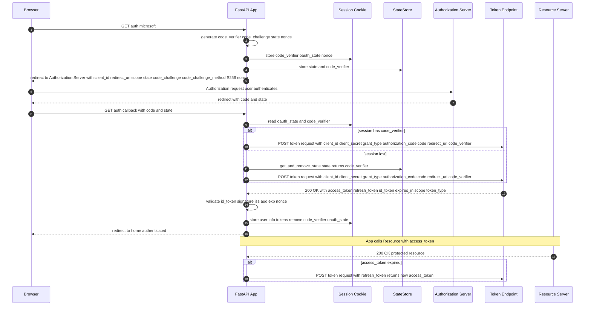

# Considerations before starting: 
- [**What you need from Azure Entra ID?**](#0-what-you-need-from-azure-entra-id)
- [**What functionality does this app offer?**](#1-what-you-need-from-azure-entra-id)
    - **Authentication & Authorization**
    - **Session Security**
    - **Transport & Browser Security Headers**
    - **Rate Limiting & DoS Protection**
    - **Additional Application Security**
- [**Public Client** vs. **Private Client**](#2-public-vs-private-app)
- [**Multi-tenant** vs. **Single-tenant**](#3-tenant-in-azure-entra-id)
- [**Access tokens** vs "**ID tokens**](#4)
- [**Implicit flows** vs. **Hybrid flows**](#5)
- [**Platforms** & **OAuth flow restrictions**](#6)
    - **SPA**: Must use browser-based CORS requests (JavaScript fetch/XMLHttpRequest)
    - **Mobile/Desktop** (PublicClient): Allows server-side token exchange with PKCE
    - **Web**: Requires client authentication (secret/certificate)
 - [**How to configure?**](#7)
     - **Private/Confidential server-side client**
     - **Public server-side client**
 - [**Code vs. Tokens**](#8)
 
# 0. What you need from Azure Entra ID?

- **Public Client (PKCE only)**
  - `Tenant ID` (or domain)
  - `Client ID`
  - `Redirect URI(s)` (registered as public client)
  - `Scopes` (openid profile offline_access + APIs)
  - `Code challenge/verifier` (runtime-generated, not from Entra)

👉 **No client secret**.

- **Confidential Client (Secret or Certificate)**
  - `Tenant ID` (or domain)
  - `Client ID`
  - `Redirect URI(s)`
  - `Scopes`
  - `Client secret` or `certificate` (securely stored)
  - (Optional) `PKCE` support - `Code challenge/verifier`

👉 **PKCE + secret/cert = strongest protection.**

# 1. What functionality does this app offer?

### A. Authentication & Authorization
- **Authorization Code Flow with PKCE (S256)**: Secure OAuth2 flow for SPAs/native apps that prevents stolen authorization codes from being reused.
- **PKCE (Proof Key for Code Exchange)**: Binds the authorization code to the client via a code_verifier + hashed code_challenge. Prevents interception attacks.
- **JWT validation**: Verifies token integrity and claims (exp, aud, iss, etc.). Ensures tokens are authentic and not expired/misused.
- **State parameter**: Random value sent in requests to protect against CSRF attacks.
- **Tokens**:
    - **Access Token**: Short-lived (1h), grants API access.
    - **ID Token**: Contains user identity claims. Used for authentication.
    - **Refresh Token**: Long-lived, allows refreshing expired access tokens.
    - **Authorization Code**: Short-lived exchange artifact, avoids token leakage.
- **Microsoft Entra ID integration**: Delegates authentication to a trusted Identity Provider.
- **Token exchange** (requests HTTP client): Secure backchannel call to swap authorization code for tokens.

### B. Session Security
- **1-hour session timeout**: Limits exposure from inactive or hijacked sessions.
- **Cookie attributes**:
    - `HttpOnly`: Prevents JS access.
    - `Secure`: Sends only over HTTPS.
    - `SameSite`: Mitigates CSRF.
    - `Path`: Restricts scope.
- **Server-side session storage**: Prevents client tampering with session state.
- **Automatic session cleanup**: Reduces memory leaks and invalid session persistence.
- **Session Recovery Mechanism**: Fallback to in-memory StateStore if persistent storage fails. Ensures availability.
- **Thread-safe session handling**: Locks prevent race conditions on concurrent session updates.
- **Starlette SessionMiddleware**: Provides standardized session management in FastAPI.

### C. Transport & Browser Security Headers
- **Content Security Policy (CSP)**: Restricts allowed sources for scripts/styles. Mitigates XSS.
- **X-Content-Type-Options: nosniff**: Prevents MIME type sniffing. Stops certain injection attacks.
- **X-Frame-Options: DENY/SAMEORIGIN**: Prevents clickjacking via iframes.
- **Strict-Transport-Security (HSTS)**: Enforces HTTPS-only access to the app.
- **Cache-Control**: Prevents sensitive pages from being cached client-side.

### D. Rate Limiting & DoS Protection
- **Request quotas (200/day, 50/hour per IP)**: Controls abusive traffic.
- **Endpoint-specific limits**: Extra protection on authentication endpoints.
- **SlowAPI integration**: Rate limiting middleware for FastAPI.
- **IP-based tracking (get_remote_address)**: Prevents brute force attempts tied to an IP.

### E. Additional Application Security
- **CORS middleware**: Restricts allowed origins for API requests.
- **Trusted Host middleware**: Blocks Host header poisoning attacks.
- **Comprehensive logging**: Debug + security logs to monitor suspicious behavior.
- **Debug endpoints (`/debug-info`)**: Safe environment for troubleshooting (with caution).
- **Health endpoint (`/health`)**: Monitors app status without leaking sensitive data.
- **Custom error handlers (`404`/`500`)**: Prevents leaking stack traces or internals.
- **Secure randomness (secrets, cryptographic entropy)**: Generates unpredictable values for tokens, states, and verifiers.

# 2. Public vs. Private App

### **Public Client**
- An application that **cannot safely store secrets** (e.g., mobile apps, SPAs, CLI tools).
- Uses **PKCE to protect against code interception**.
- Does **not authenticate** with a **client secret**.
- **No secure server-side environment**
- In public clients, all code executes **on devices** you don’t control.
- Unlike a backend server, there’s **no trusted**, **isolated runtime** to protect the secret.

### **Confidential Client (Private)**
- An application that can **safely store secrets** (e.g., server-side apps, daemons).
- Uses **client secret** or **certificate for authentication**.
- Can also use **PKCE as an additional security layer**.

| Aspect                 | Public Client (PKCE only)           | Confidential Client (Secret/Cert + PKCE optional) |
| ---------------------- | ----------------------------------- | ------------------------------------------------- |
| **Secret storage**     | No secret (unsafe environment)      | Secret or certificate securely stored             |
| **PKCE usage**         | Required                            | Optional (but recommended)                        |
| **Security guarantee** | Proof-of-possession (via PKCE) only | Secret-based authentication + optional PKCE       |
| **Use cases**          | Mobile apps, SPAs, CLI tools        | Server-side apps, web APIs, background services   |


# 2. Tenant in Azure Entra ID?

- A tenant is an instance of Microsoft Entra ID that an organization receives when it signs up for Microsoft cloud services (e.g., Microsoft 365, Azure, Dynamics 365).
- It represents an organization and contains users, groups, applications, and subscriptions.


# 3. Access tokens vs. ID tokens

- Access tokens (used for implicit flows) vs. ID tokens (used for implicit and hybrid flows)


# How to configure?

## A. A public server-side Client

# 1. Azure AD Configuration Changes Required
### 1. Enable Public Client Flows
- In our Azure AD app registration:
- Go to Authentication → Advanced settings
- Set "Allow public client flows" to Yes
This is the crucial setting that tells Azure AD this app can use PKCE without a client secret

### 2. Verify Platform Configuration
- In Authentication → Platform configurations
- Make sure you have a Mobile/Desktop platform configured
- Add redirect URI: `http://localhost:8080/auth/callback`
- Enable ID tokens checkbox

If we chose Web platform configured (not Mobile/Desktop) - we should have this issue "Tokens issued for the 'Single-Page Application' client-type may only be redeemed via cross-origin requests."
This means Microsoft expects SPA applications to make token requests from the browser using CORS, not from a server-side application. 
Our FastAPI app is making a server-to-server POST request, which Microsoft blocks for SPA platform types.
Since our FastAPI app makes server-side HTTP requests (not browser CORS requests), you need the Mobile/Desktop platform type, which allows public clients to make server-side token requests with PKCE protection.

### 3. Remove Any Client Secrets (Optional)
- Go to Certificates & secrets
- You can delete any existing client secrets since they won't be used

### 4. Verify API Permissions

In API permissions, ensure you have:

openid
profile
email
offline_access


0. Initialization
 - **Tenant ID (or domain)** - Used in our authority URLs:
```
https://login.microsoftonline.com/{tenant_id}/oauth2/v2.0/authorize
https://login.microsoftonline.com/{tenant_id}/oauth2/v2.0/token
```
- **Client (Application) ID** - Identifies our app.
- **Redirect URI** Must be registered in the app as a **public client** redirect URI (e.g. `http://localhost:5000/callback` if developing locally).
- **Scopes**
- At minimum: `openid` `profile` `offline_access` `email` + any API scopes (e.g. `api://<resource-app-id>/.default` or `https://graph.microsoft.com/User.Read`).

1. **User visits the app and clicks "login".** The browser makes a request to your FastAPI app (e.g. `/auth/microsoft`).
   
2. Server generates **PKCE** and **state values**. The app (server code) generates:
  - a `code_verifier` (**random secret**),
  - a `code_challenge` (**SHA256** of the verifier),
  - a `state` (CSRF guard).
These values are created **on the server**, **not by the remote authorization server**.
Our App (Server Provider) creates `code verifier` + `challenge`. Generate a random string (`code_verifier`) and its **SHA256-based Base64URL-encoded hash** (`code_challenge`).

3. The server stores **those values in two places**.
  - It stores them in `request.session` (**Starlette session**). Important: with Starlette's default `SessionMiddleware`, **session data is serialized into a cookie** and **sent to the browser** (signed but not encrypted).
  - It also stores {`state` -> `code_verifier`, `timestamp`} in **an in-memory** `StateStore` as a server-side backup.
    
4. Server **builds the authorization URL** and **redirects the user's browser**.
The URL includes
  - `client_id`,
  - `response_type=code`,
  - `redirect_uri`,
  - `scope`,
  - `state`,
  - `code_challenge`, and
  - `code_challenge_method=S256`.
The browser is redirected to **Microsoft’s authorization endpoint**.

```
GET https://login.microsoftonline.com/{tenant}/oauth2/v2.0/authorize
?client_id={client_id}
&response_type=code
&redirect_uri={redirect_uri}
&response_mode=query
&scope={scopes}
&code_challenge={code_challenge}
&code_challenge_method=S256
```

6. **User authenticates & consents at Microsoft**.
Microsoft prompts the user to **sign in/consent**. The authorization server **records the authorization grant**, including the `code_challenge` and `state` **associated with that authorization request**, so it can verify them later when the code is exchanged.

7. **Authorization server redirects the browser** back to your `callback` with `code` and `state`.
Microsoft sends the browser back to `REDIRECT_URI` (our `/auth/callback`) with **query parameters like ?code=...&state=....**

8. Your **callback retrieves** `state` and `code_verifier`, then **exchanges the code for tokens**.
  - The callback checks the `state` against the `session oauth_state` (and — if the session was lost — it looks up the `code_verifier` in the **in-memory** `StateStore` backup).
  - It retrieves the `code_verifier` (from **session** or **backup**) and then makes a server-side POST to the token endpoint with:
    - `client_id`,
    - `client_secret`,
    - `code`,
    - `redirect_uri`,
    - `grant_type=authorization_code`, and
    - `code_verifier`.
   
```
POST https://login.microsoftonline.com/{tenant}/oauth2/v2.0/token
Content-Type: application/x-www-form-urlencoded

client_id={client_id}
grant_type=authorization_code
code={authorization_code}
redirect_uri={redirect_uri}
code_verifier={code_verifier}
```

8. **Authorization server validates the token request**.
The **auth server verifies the authorization code**, ensures the `code_verifier` matches the previously stored `code_challenge`, verifies the `client_id` (and `client_secret` if provided), and checks redirect URI, etc.

9. **If valid, the token endpoint returns tokens**.
Microsoft returns `access_token`, `id_token` (because we asked for openid), and usually `refresh_token` and `expires_in`.

10. **Our app decodes/uses the ID token and stores user info**.
In the code we call `validate_id_token()` then put **user info** and **tokens** into `request.session` and set `login_time`. We then clear `code_verifier` and `oauth_state` from the **session** and redirect the user to `/`.

11. **The app can use the access token to call our services**.
When we need protected resources, use the `access_token` in `Authorization headers`. When the token expires, use the `refresh_token` **to get a new access token**.




