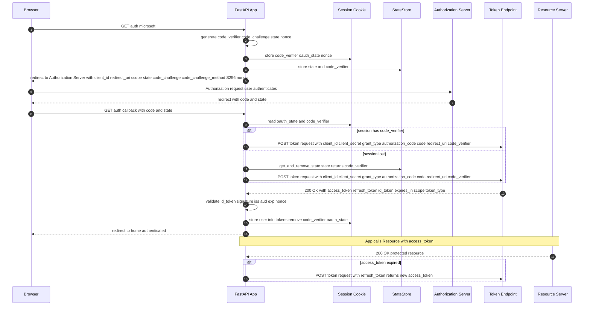

## OAuth 2.0 with PKCE Flow:

## Requirements before starting: 
### Public vs. Private App

- **Public Client**
  - An application that **cannot safely store secrets** (e.g., mobile apps, SPAs, CLI tools).
  - Uses **PKCE to protect against code interception**.
  - Does **not authenticate** with a **client secret**.
  - **No secure server-side environment**
    - In public clients, all code executes **on devices** you don’t control.
    - Unlike a backend server, there’s **no trusted**, **isolated runtime** to protect the secret.

- **Confidential Client (Private)**
  - An application that can **safely store secrets** (e.g., server-side apps, daemons).
  - Uses **client secret** or **certificate for authentication**.
  - Can also use **PKCE as an additional security layer**.

| Aspect                 | Public Client (PKCE only)           | Confidential Client (Secret/Cert + PKCE optional) |
| ---------------------- | ----------------------------------- | ------------------------------------------------- |
| **Secret storage**     | No secret (unsafe environment)      | Secret or certificate securely stored             |
| **PKCE usage**         | Required                            | Optional (but recommended)                        |
| **Security guarantee** | Proof-of-possession (via PKCE) only | Secret-based authentication + optional PKCE       |
| **Use cases**          | Mobile apps, SPAs, CLI tools        | Server-side apps, web APIs, background services   |

### What you need from Azure Entra ID

- **Public Client (PKCE only)**
  - `Tenant ID` (or domain)
  - `Client ID`
  - `Redirect URI(s)` (registered as public client)
  - `Scopes` (openid profile offline_access + APIs)
  - `Code challenge/verifier` (runtime-generated, not from Entra)

👉 No client secret.

- **Confidential Client (Secret or Certificate)**
  - `Tenant ID` (or domain)
  - `Client ID`
  - `Redirect URI(s)`
  - `Scopes`
  - `Client secret` or `certificate` (securely stored)
  - (Optional) `PKCE` support - `Code challenge/verifier`

👉 PKCE + secret/cert = strongest protection.


### Deep Dive
1. **Tenant ID (or domain)** - Used in our authority URLs:
```
https://login.microsoftonline.com/{tenant_id}/oauth2/v2.0/authorize
https://login.microsoftonline.com/{tenant_id}/oauth2/v2.0/token
```

2. **Client (Application) ID** - Identifies our app.

3. **Redirect URI** Must be registered in the app as a **public client** redirect URI (e.g. `http://localhost:5000/callback` if developing locally).

4. **Scopes**
  - At minimum: `openid` `profile` `offline_access`
  - Plus any API scopes (e.g. `api://<resource-app-id>/.default` or `https://graph.microsoft.com/User.Read`).

5. **Flow with PKCE (public client)**
  1. Create `code verifier` + `challenge`
    - Generate a random string (`code_verifier`) and its **SHA256-based Base64URL-encoded hash** (`code_challenge`).
  2. Authorization request (user signs in) - Send user to:
```
GET https://login.microsoftonline.com/{tenant}/oauth2/v2.0/authorize
?client_id={client_id}
&response_type=code
&redirect_uri={redirect_uri}
&response_mode=query
&scope={scopes}
&code_challenge={code_challenge}
&code_challenge_method=S256
```
👉 User signs in, Entra ID redirects back with `?code=...`

  3. Token exchange (server-side, no secret)
```
POST https://login.microsoftonline.com/{tenant}/oauth2/v2.0/token
Content-Type: application/x-www-form-urlencoded

client_id={client_id}
grant_type=authorization_code
code={authorization_code}
redirect_uri={redirect_uri}
code_verifier={code_verifier}
```
👉 Returns `id_token`, `access_token`, `refresh_token`

## Concepts in this tutorial

### Authorization Code Flow with PKCE (S256 method)
- PKCE (Proof Key for Code Exchange) adds a `code_verifier` and `code_challenge` to bind the code to the client
  - **Code verifier generation** (random 32 bytes, base64 encoded)
  - **Code challenge creation** (SHA256 hash of verifier)
  - **Server-side verification** during token exchange
- **JWT validation** (signature, claims: `exp`, `aud`, `iss`, `nonce`, `azp`)
- **State** parameter for **CSRF** protection
- **Access tokens**, **refresh tokens**, **ID tokens** (and `id_token` usage)
  - **Access Token**: JWT format, ~1500+ characters, expires in 1 hour
  - **ID Token**: JWT with user claims (sub, name, email, etc.)
  - **Refresh Token**: Opaque string, ~2000 characters, expires in ~90 days
  - **Authorization Code**: Temporary code, ~2000 characters, expires in 10 minutes
- Microsoft Entra ID integration
- Use of `requests` for **token exchange** (HTTP client)
  
### Session Security:
- 1-hour session timeout
- **Cookie attributes** (`SameSite`, `Path`, `Secure`, `HttpOnly`)
- **Server-side session storage**
- **Automatic session cleanup**
- **Session Recovery Mechanism**: fallback from session storage to **in-memory state store**
  - In-memory `StateStore` backup + threading lock
- **Session management** (Starlette `SessionMiddleware` and `request.session`)

### Comprehensive Security Headers:
- Content Security Policy (CSP)
- `X-Content-Type-Options`, `X-Frame-Options`
- Strict-Transport-Security (HSTS)
- **Cache-Control** for sensitive pages

### Rate Limiting & DoS Protection:
- 200 requests/day, 50 requests/hour per IP
  - Use of `get_remote_address` for IP-related checks
- Special limits for authentication endpoints
- SlowAPI integration with FastAPI

### Additional Security:
- **CORS middleware** and **allowed origins**
- Trusted host middleware
- Comprehensive **logging**
- Logging (level DEBUG, sensitive logs)
- Debug endpoints & `/debug-info` page
- Health endpoint `/health`
- Error handlers and exception handling (custom 404/500 pages)
- Use of `secrets` & `cryptographic` randomness
  - High entropy randomness for `state`, `code_verifier`, `tokens`.
 
## The flow

1. **User visits the app and clicks "login".** The browser makes a request to your FastAPI app (e.g. `/auth/microsoft`).
   
3. Server generates **PKCE** and **state values**. The app (server code) generates:
  - a `code_verifier` (**random secret**),
  - a `code_challenge` (**SHA256** of the verifier),
  - a `state` (CSRF guard).
These values are created **on the server**, **not by the remote authorization server**.

3. The server stores **those values in two places**.
  - It stores them in `request.session` (**Starlette session**). Important: with Starlette's default `SessionMiddleware`, **session data is serialized into a cookie** and **sent to the browser** (signed but not encrypted).
  - It also stores {`state` -> `code_verifier`, `timestamp`} in **an in-memory** `StateStore` as a server-side backup.
    
4. Server **builds the authorization URL** and **redirects the user's browser**.
The URL includes
  - `client_id`,
  - `response_type=code`,
  - `redirect_uri`,
  - `scope`,
  - `state`,
  - `code_challenge`, and
  - `code_challenge_method=S256`.
The browser is redirected to **Microsoft’s authorization endpoint**.

6. **User authenticates & consents at Microsoft**.
Microsoft prompts the user to **sign in/consent**. The authorization server **records the authorization grant**, including the `code_challenge` and `state` **associated with that authorization request**, so it can verify them later when the code is exchanged.

7. **Authorization server redirects the browser** back to your `callback` with `code` and `state`.
Microsoft sends the browser back to `REDIRECT_URI` (our `/auth/callback`) with **query parameters like ?code=...&state=....**

8. Your **callback retrieves** `state` and `code_verifier`, then **exchanges the code for tokens**.
  - The callback checks the `state` against the `session oauth_state` (and — if the session was lost — it looks up the `code_verifier` in the **in-memory** `StateStore` backup).
  - It retrieves the `code_verifier` (from **session** or **backup**) and then makes a server-side POST to the token endpoint with:
    - `client_id`,
    - `client_secret`,
    - `code`,
    - `redirect_uri`,
    - `grant_type=authorization_code`, and
    - `code_verifier`.

8. **Authorization server validates the token request**.
The **auth server verifies the authorization code**, ensures the `code_verifier` matches the previously stored `code_challenge`, verifies the `client_id` (and `client_secret` if provided), and checks redirect URI, etc.

9. **If valid, the token endpoint returns tokens**.
Microsoft returns `access_token`, `id_token` (because we asked for openid), and usually `refresh_token` and `expires_in`.

10. **Our app decodes/uses the ID token and stores user info**.
In the code we call `validate_id_token()` then put **user info** and **tokens** into `request.session` and set `login_time`. We then clear `code_verifier` and `oauth_state` from the **session** and redirect the user to `/`.

11. **The app can use the access token to call our services**.
When we need protected resources, use the `access_token` in `Authorization headers`. When the token expires, use the `refresh_token` **to get a new access token**.



## Code / tokens

| Token/Code                    | Purpose                 | Real-life Value               | 
| ----------------------------- | ----------------------- | ----------------------------- |
| `code_verifier`               | PKCE secret             | Prevent code theft            |
| `code_challenge`              | PKCE hash               | Links request to verifier     |
| `state`                       | CSRF protection         | Prevents CSRF attacks         |
| `nonce`                       | OIDC replay protection  | ID token bound to request     |
| `authorization code` (`code`) | Temporary grant         | Exchange for tokens           |
| `access_token`                | API authorization       | Call protected resources      |
| `refresh_token`               | Refresh access token    | Keep user logged in           |
| `id_token`                    | User identity           | Know user info                |
| `session cookie`              | Store user/session data | Maintain login state          | 
| JWKS                          | Token verification      | Ensure ID token is legitimate |

### 1. `code_verifier`

- **What**: A cryptographically random secret used by the client to prove it initiated the auth request (PKCE).
- **Purpose**: It proves to the authorization server that the token request is coming from the same client that started the authorization request (PKCE security). Prevents “authorization code interception” attacks, especially for public clients (mobile apps, SPAs, or when session cookies might be exposed).
- **How produced (in our code)**: `base64.urlsafe_b64encode(secrets.token_bytes(32)).decode().rstrip('=')`
- **Allowed chars (RFC 7636)**: letters, digits and - . _ ~ (but base64url typically yields A-Za-z0-9-_)
- **Length (RFC)**: between 43 and 128 characters.
```
code_verifier = "qH1a8fGkL3v9Y2Q0bTf7PzUoWc4mR5xA6n_0XyZq-1"
```

### 2. code_challenge (S256)

- **What**: Derived from code_verifier (SHA256 + base64url). Sent to the authorization server in the initial request.
- **Purpose**: Tells the authorization server how to check the `code_verifier` later. Only the holder of `code_verifier` can correctly respond. Links the initial authorization request with the token request securely.
- **How**: `code_challenge = base64url_encode( SHA256(code_verifier) ).rstrip('=')`
- **Example derivation (pseudocode)**:
```
digest = SHA256("qH1a8fGkL3v9Y2Q0...")
code_challenge = base64url(digest).rstrip("=")
code_challenge = "X8h6s9V6y2tQW3xLaFzPq7eU-3jBv1yY9Rkz4dQwHqM"
```

### 3. state

- **What**: CSRF protection token — random value tied to the auth request.
- How produced (in our code): secrets.token_urlsafe(32) (or generate_state()).
- Length: typically ~43 characters (depends on bytes used).
- Example:
```
state = "u2FhKs0QfX7Z9qYb3LpTg4v8r1wHj6N_aP0s"
```

### 4. nonce

What: OIDC nonce to bind ID token to request — prevents token replay.

How: secrets.token_urlsafe(...) (server generates, stores in session and sends in authorization request).

Example:

nonce = "n8SxT2v9dQ7_aB4mYwL0"

5) Authorization Code (code) — returned by authorization server

What: Short-lived code returned to redirect_uri after user authenticates. Used once to exchange for tokens.

Format: Opaque string, often URL-safe characters.

Lifetime: short (usually a few minutes) and single-use.

Example:

code = "AQABAAIAAAAmK...Zx"  (short opaque string)

6) Token request (exchange code for tokens) — HTTP POST (form encoded)

Example request (application/x-www-form-urlencoded):

POST https://login.microsoftonline.com/<TENANT>/oauth2/v2.0/token
Content-Type: application/x-www-form-urlencoded

client_id=YOUR_CLIENT_ID
&client_secret=YOUR_CLIENT_SECRET    # optional with public clients; present in confidential clients
&grant_type=authorization_code
&code=AUTH_CODE_FROM_CALLBACK
&redirect_uri=http%3A%2F%2Flocalhost%3A8080%2Fauth%2Fcallback
&code_verifier=CODE_VERIFIER_VALUE

7) Token response (JSON) — example
{
  "token_type": "Bearer",
  "expires_in": 3600,
  "ext_expires_in": 3600,
  "access_token": "eyJhbGciOiJ... (or opaque string)",
  "refresh_token": "0.AAA...opaque.refresh.token...",
  "id_token": "eyJhbGciOiJSUzI1NiIsImtpZCI6Ij...signature"
}


access_token: used with Authorization: Bearer <access_token> to call resource APIs.

refresh_token: keep confidential, used to request new access tokens.

id_token: OpenID Connect token (a JWT). It proves the user's identity.

8) id_token (OpenID Connect ID token) — JWT format

Structure: header.payload.signature — three base64url parts separated by .

Header example:

{"alg":"RS256","kid":"abcd1234","typ":"JWT"}


base64url -> e.g. eyJhbGciOiJSUzI1NiIsImtpZCI6ImFiY2QxMjM0In0

Payload (claims) example:

{
  "iss": "https://login.microsoftonline.com/<TENANT>/v2.0",
  "sub": "aaaaaaaa-bbbb-cccc-dddd-eeeeeeeeeeee",
  "aud": "YOUR_CLIENT_ID",
  "exp": 1730000000,
  "iat": 1729996400,
  "nonce": "n8SxT2v9dQ7_aB4mYwL0",
  "name": "Alice Example",
  "preferred_username": "alice@example.com",
  "email": "alice@example.com"
}


Signature: signed by provider (RS256 usually) — base64url segment.

Full example (dummy):

id_token = "eyJhbGciOiJSUzI1NiIsImtpZCI6ImFiYy...header... . eyJpc3MiOiJodHRwczovL2...payload... . SflKxwRJSMeKKF2QT4fwpMeJf36POk6yJV_adQssw5c"

9) access_token (format possibilities)

Opaque string: random-looking string (common in some providers).

Example: access_token = "0.AAAAABBBB.CCddEEfGh..."

JWT: sometimes the access_token itself is a JWT (signed token) — format like id_token.

Example: access_token = "eyJraWQiOiJ... (header).eyJzdWIiOi... (payload).signature"

Usage: Authorization: Bearer <access_token>

10) refresh_token

What: Long-lived, opaque token used to obtain new access tokens.

Format: opaque string (not JWT).

Example:

refresh_token = "0.AAAABBBBCCCCDDDD1234abcd...long-opaque-string"

11) Session cookie (how request.session is stored by default)

What: Starlette/SessionMiddleware serializes session dict into a cookie (signed). That means values like code_verifier, access_token, refresh_token may end up in the cookie unless you change storage.

Example (conceptual):

Set-Cookie: session="gAJ9cQE...signed_base64..."; Path=/; HttpOnly; SameSite=Lax; Secure


Warning: This is risky for tokens. Better to use server-side sessions (Redis or DB) or encrypt cookie contents.

12) JWKS (JSON Web Key Set) — public keys used to verify JWTs

Usage: fetch from /.well-known/openid-configuration → jwks_uri, then GET the JWKS JSON.

One key entry example:

{
  "keys": [
    {
      "kty": "RSA",
      "kid": "abcd1234",
      "use": "sig",
      "alg": "RS256",
      "n": "0vx7agoebGcQS...base64url-modulus...",
      "e": "AQAB"
    }
  ]
}

Example end-to-end (compact) — GET URL and token exchange

Authorization request (browser GET):

GET https://login.microsoftonline.com/<TENANT>/oauth2/v2.0/authorize?
client_id=YOUR_CLIENT_ID
&response_type=code
&redirect_uri=http%3A%2F%2Flocalhost%3A8080%2Fauth%2Fcallback
&scope=openid%20profile%20email
&state=u2FhKs0QfX7...
&code_challenge=X8h6s9V6y2t...
&code_challenge_method=S256
&nonce=n8SxT2v9...


Token exchange (server-side POST):

POST https://login.microsoftonline.com/<TENANT>/oauth2/v2.0/token
Content-Type: application/x-www-form-urlencoded

client_id=YOUR_CLIENT_ID
&client_secret=YOUR_CLIENT_SECRET
&grant_type=authorization_code
&code=AUTH_CODE_FROM_CALLBACK
&redirect_uri=http%3A%2F%2Flocalhost%3A8080%2Fauth%2Fcallback
&code_verifier=qH1a8fGkL3v9Y2Q0bTf7Pz...


Token response (JSON) — example already shown above.

Quick pseudocode: compute code_challenge (Python-like)
import hashlib, base64

def code_challenge_from_verifier(verifier: str) -> str:
    digest = hashlib.sha256(verifier.encode('ascii')).digest()
    b64 = base64.urlsafe_b64encode(digest).decode('ascii')
    return b64.rstrip('=')


## Deep dive

#### StateStore 
`StateStore` class is a **thread-safe**, **temporary in-memory storage** for "states" with associated metadata (a **code verifier** + **timestamp**)
The `StateStore` saves the `code_verifier` temporarily (along with the `state`) so that later, **when the redirect comes back**, our app **can retrieve it and complete the token exchange**.

`code_verifier` is a **random**, **high-entropy string** (like a long random password) **generated by our app** before redirecting **the user to the identity provider** (e.g., Google, Auth0).
From the code verifier, **our app derives a code challenge** (usually by applying SHA-256 and Base64 URL encoding).

**Race condition** occurs when **multiple threads or processes read** and **write the same variable** i.e. they have access to some shared data and they try to change it at the same time. In such a scenario threads are “racing” each other to access/change the data.

```python
class StateStore:
    def __init__(self):
        self._store = {}
        self._lock = threading.Lock()

# self._store: A dictionary that holds state entries.
# self._lock: A threading lock to ensure thread safety (so multiple threads don’t modify the store at the same time).
        
    def set_state(self, state: str, code_verifier: str):
        with self._lock:
            self._store[state] = {
                'code_verifier': code_verifier,
                'timestamp': datetime.utcnow()
            }
            # Clean up old entries (older than 10 minutes)
            cutoff = datetime.utcnow() - timedelta(minutes=10)
            self._store = {k: v for k, v in self._store.items() 
                          if v['timestamp'] > cutoff}
            logger.debug(f"State store now has {len(self._store)} entries")
    
    def get_and_remove_state(self, state: str) -> str:
        with self._lock:
            data = self._store.pop(state, None)
            if data:
                logger.debug(f"Retrieved state from backup store")
                return data['code_verifier']
            logger.debug(f"State not found in backup store")
            return None
```

- Race Condition, Deadlock and Threat Block

### Code verifier
`code verifier` is only known to the client (our app), and we’ll need it later to finish the flow:

- **Step 1** – Start Auth Request
  - Our app generates a `state` and a `code verifier`.
  - It stores the `code verifier` temporarily (in memory, DB, or a structure like our StateStore).
  - It derives a `code challenge` and sends it to the **identity provider** with the **state**.

``` shell
/authorize?client_id=...&state=XYZ&code_challenge=HASH(verifier)&...
```

- **Step 2 – User Authenticates**
  - The user logs in at the provider.
  - The provider redirects back to our app with the `state` and an `authorization code`.

``` shell
/callback?state=XYZ&code=AUTH_CODE
```

- **Step 3 – Token Exchange**
  - Our app **retrieves the stored code verifier** for that state.
  - It sends the `AUTH_CODE` + `code_verifier` to the provider’s token endpoint.

``` shell
POST /token
{
  "code": "AUTH_CODE",
  "code_verifier": "ORIGINAL_RANDOM_STRING"
}
```
- The provider **recomputes the hash** from **our verifier** and checks it against the `code_challenge` from Step 1.
- If they match → we’re the legitimate client → we get tokens (access/refresh).

## The flow

## Improvements

1. You do NOT fully validate the ID token.
validate_id_token() currently uses jwt.get_unverified_claims(id_token) — that only reads claims without verifying signature, issuer, audience, expiration, or nonce. This is unsafe. You must fetch Microsoft’s JWKS and verify the JWT signature and claims (iss, aud, exp, nonce).

2. You did not use or validate a nonce.
For OpenID Connect you should send a nonce in the authorization request and verify the same nonce claim in the id_token. This prevents replay attacks on the ID token.

3. Session storage is client-side by default (cookie).
With Starlette’s default SessionMiddleware, request.session is serialized into a cookie (signed but not encrypted). That means code_verifier, access_token, and refresh_token may be stored in the browser cookie. That is risky. Use a server-side session store (Redis, database) or encrypt server-side.

4. You log sensitive data.
The code logs request.session, request.cookies, and token info in debug. Don’t log tokens, code_verifier, client_secret, or full session data.

5. Client secret hardcoded in source.
Do not store CLIENT_SECRET (or SECRET_KEY) in code. Use environment variables or a secret manager.

6. No token refresh logic implemented.
You store refresh_token but do not refresh access tokens when they expire. Add a refresh flow (POST grant_type=refresh_token) and maintain expiry (expires_in).

7. Blocking I/O in async routes.
You use requests.post inside async endpoints. requests is synchronous and will block the event loop. Use an async HTTP client (e.g., httpx.AsyncClient) or run blocking calls in a threadpool.

8. StateStore is in-memory, not suitable for multiple instances.
Your StateStore is process memory. If you run multiple app instances, session or backup lookups will fail. Use Redis or other shared store for state/code_verifier backup.

9. Cookie flags for production.
In production, set session cookie Secure=True, HttpOnly=True, and appropriate SameSite. Use HTTPS and set https_only=True for SessionMiddleware.

10. No signature/claim checks for ID tokens and no audience/issuer validation.
See #1. Check aud equals CLIENT_ID, iss equals Microsoft issuer for your tenant, exp not expired, etc.

11. No CSRF/extra checks beyond state.
state is good, but validate strictly. Currently if state mismatches you don't fail immediately — you try backup. That is OK to handle session loss, but be careful and log carefully.

No nonce handling for ID token.

See #2. Add nonce both for security and correct OIDC usage.

Logout token revocation not implemented.

You redirect to Microsoft logout, but you may also want to revoke refresh tokens at the token revocation endpoint on logout.

Timezones / datetime usage.

You use naive datetime with utcnow() and fromisoformat(); being explicit about timezone (aware datetimes) avoids subtle bugs.

## Bibliography
- https://developer.reachfive.com/docs/flows/authorization-code-pkce.html
- https://docs.abblix.com/docs/openid-connect-flows-explained-simply-from-implicit-flows-to-authorization-code-flows-with-pkce-and-bff
