# OAuth using OIDC Authentication with PKCE for a Public and Private Client

## Considerations before starting:
- [**What you need from Azure Entra ID?**](#what-you-need-from-azure-entra-id)
- [**What functionality does this app offer?**](#what-functionality-does-this-app-offer)
    - [Authentication & Authorization](#a-authentication--authorization)
    - [Session Security](#b-session-security)
    - [Transport & Browser Security Headers](#c-transport--browser-security-headers)
    - [Rate Limiting & DoS Protection](#d-rate-limiting--dos-protection)
    - [Additional Application Security](#e-additional-application-security)
- [**Public Client** vs. **Private Client**](#public-vs-private-app)
- [**Multi-tenant** vs. **Single-tenant**](#tenant-in-azure-entra-id)
- [**Code vs. Tokens**](#code-vs-tokens)
- [**Access tokens** vs **ID tokens**]()
- [**Implicit flows** vs. **Hybrid flows**]()
- [**OIDC AuthZ with PKCE flow**]
- [**How to configure?**]()
     - **Private/Confidential server-side client**
     - **Public server-side client**
     - **Platforms** & **OAuth flow** restrictions
       - **SPA**: Must use browser-based CORS requests (JavaScript fetch/XMLHttpRequest)
       - **Mobile/Desktop** (PublicClient): Allows server-side token exchange with PKCE
       - **Web**: Requires client authentication (secret/certificate)
 - [**Introspection endpoints**](#introspection-endpoints)
 - [**Dictionary of Codes and Tokens**](#dictionary-of-codes-and-tokens)
     - [code_verifier](#1-code_verifier)
     - [code_challenge](#2-code_challenge-s256)
     - [state](#3-state)
     - [nonce](#4-nonce)
     - [Authorization Code](#5-authorization-code-code--returned-by-authorization-server)
     - [Access Token](#6-access-token--returned-by-token-endpoint)
     - [Refresh Token](#7-refresh-token--included-in-token-response)
     - [ID Token](#8-id-token-id_token--openid-connect-identity-token)
     - [Refresh Token](#9-access-token)
     - [Session Cookie](#10-refresh-token-format)
     - [JWKS](#12-jwks-json-web-key-set--public-signing-keys)
 - [**Bearer token**]()
 - [**Layout of this project**]
 - [**How to add a new features?**]()
 - [**Traditional Cookie-Based Auth** vs **Modern Token Based Auth**](#cookie-based-auth-vs-token-based-auth)
   - **Cookie-based auth** relies on **server-side sessions** and cookies handled by the browser.
   - **Token-based auth** relies on **stateless tokens (JWTs)** that the client must attach explicitly to requests.
- [**The Two-Cookie Architecture: Understanding SSO in Azure Entra ID**](#the-two-cookie-architecture-understanding-sso-in-azure-entra-id)
- [**LocalStorage** vs. **Session** vs. **Cookie**](#cookie-vs-session-vs-local-storage)
- **Should JWT Token be stored in a cookie, header or body?**

                                                 +-------------------+
                                                 |   Authz Server    |
       +--------+                                | +---------------+ |
       |        |--(A)- Authorization Request ---->|               | |
       |        |       + t(code_verifier), t_m  | | Authorization | |
       |        |                                | |    Endpoint   | |
       |        |<-(B)---- Authorization Code -----|               | |
       |        |                                | +---------------+ |
       | Client |                                |                   |
       |        |                                | +---------------+ |
       |        |--(C)-- Access Token Request ---->|               | |
       |        |          + code_verifier       | |    Token      | |
       |        |                                | |   Endpoint    | |
       |        |<-(D)------ Access Token ---------|               | |
       +--------+                                | +---------------+ |
                                                 +-------------------+
- *Request along with the transformation method "t_m"*
- https://datatracker.ietf.org/doc/html/rfc7636

#### Simplified flow - when a user signs in at a Resource Provider (Authorization Code + PKCE)

##### Actors:
- User — human authenticating.
- Client (SP) — app at adriensieg registered in Entra ID.
- Authorization Server (AS / IdP) — Azure Entra ID (OpenID Provider).
- Resource Server (RS) — API accepting access tokens.
  
##### Simplified flow: 
1. **<mark>Client prepares PKCE parameters</mark>**
```
code_verifier = random(43–128 chars)
code_challenge = BASE64URL(SHA256(code_verifier))
```

2. **<mark>Browser → Client starts OIDC Auth Request</mark>**

```
GET https://login.microsoftonline.com/<tenant_id>/oauth2/v2.0/authorize?
    response_type=code
    &client_id=<client_id>
    &scope=openid profile email offline_access api://<resource_api_id>/.default
    &redirect_uri=https://adriensieg/callback
    &state=<random_state>
    &nonce=<random_nonce>
    &code_challenge=<pkce_challenge>
    &code_challenge_method=S256
```

3. **<mark>User authenticates at Azure Entra ID</mark>**
  - Enters credentials / MFA.
  - Grants consent to requested scopes.

4. **<mark>Authorization Server → redirects back to Client</mark>**
```
https://adriensieg/callback?code=<auth_code>&state=<state>
https://localhost/callback?code=<auth_code>&state=<state>
```

5. **<mark>Client → Token Request (back channel)</mark>**
```
POST https://login.microsoftonline.com/<tenant_id>/oauth2/v2.0/token
Content-Type: application/x-www-form-urlencoded

grant_type=authorization_code
code=<auth_code>
client_id=<client_id>
redirect_uri=https://adriensieg/callback
code_verifier=<original_code_verifier>
```
(If confidential client → include client_secret or use client_assertion)

6. **<mark>Authorization Server → Token Response</mark>**
```
{
  "token_type": "Bearer",
  "expires_in": 3600,
  "access_token": "eyJhbGciOiJIUzI1NiIs...",
  "id_token": "eyJhbGciOiJSUzI1NiIs...",
  "refresh_token": "..."   // optional
}
```

7. **<mark>Client validates tokens</mark>**
  - Verify `id_token` claims: `iss`, `aud`, `exp`, `nonce`, `signature`.
  - Use `id_token` to establish local user session.
  - Store `refresh_token` securely (if present).

8. **<mark>Client → Resource Server</mark>**
```
GET https://api.adriensieg/resource
Authorization: Bearer <access_token>
```

9. **<mark>RS validates access token</mark>**
  - Checks signature, `iss`, `aud`, `exp`, `scopes`.
  - Grants or denies resource access.

10. **<mark>(Optional) Token refresh</mark>**
```
POST /token
grant_type=refresh_token
client_id=<client_id>
refresh_token=<refresh_token>
```

End result:
- `id_token` → proves identity (for session at SP).
- `access_token` → allows API calls to RS.
- `refresh_token` → allows silent renewal (if offline_access granted).
  
# What you need from Azure Entra ID?
- **Public Client (PKCE only)**
  - `Tenant ID` (or domain)
  - `Client ID`
  - `Redirect URI(s)` (registered as public client)
  - `Scopes` (openid profile offline_access + APIs)
  - `Code challenge/verifier` (runtime-generated, not from Entra)

👉 **No client secret**.

- **Confidential Client (Secret or Certificate)**
  - `Tenant ID` (or domain)
  - `Client ID`
  - `Redirect URI(s)`
  - `Scopes`
  - `Client secret` or `certificate` (securely stored)
  - (Optional) `PKCE` support - `Code challenge/verifier`

👉 **PKCE + secret/cert = strongest protection.**

# What functionality does this app offer?

### A. Authentication & Authorization
- **Authorization Code Flow with PKCE (S256)**: Secure OAuth2 flow for SPAs/native apps that prevents stolen authorization codes from being reused.
- **PKCE (Proof Key for Code Exchange)**: Binds the authorization code to the client via a code_verifier + hashed code_challenge. Prevents interception attacks.
- **JWT validation**: Verifies token integrity and claims (exp, aud, iss, etc.). Ensures tokens are authentic and not expired/misused.
- **State parameter**: Random value sent in requests to protect against CSRF attacks.
- **Tokens**:
    - **Access Token**: Short-lived (1h), grants API access.
    - **ID Token**: Contains user identity claims. Used for authentication.
    - **Refresh Token**: Long-lived, allows refreshing expired access tokens.
    - **Authorization Code**: Short-lived exchange artifact, avoids token leakage.
- **Microsoft Entra ID integration**: Delegates authentication to a trusted Identity Provider.
- **Token exchange** (requests HTTP client): Secure backchannel call to swap authorization code for tokens.

### B. Session Security
- **1-hour session timeout**: Limits exposure from inactive or hijacked sessions.
- **Cookie attributes**:
    - `HttpOnly`: Prevents JS access.
    - `Secure`: Sends only over HTTPS.
    - `SameSite`: Mitigates CSRF.
    - `Path`: Restricts scope.
- **Server-side session storage**: Prevents client tampering with session state.
- **Automatic session cleanup**: Reduces memory leaks and invalid session persistence.
- **Session Recovery Mechanism**: Fallback to in-memory StateStore if persistent storage fails. Ensures availability.
- **Thread-safe session handling**: Locks prevent race conditions on concurrent session updates.
- **Starlette SessionMiddleware**: Provides standardized session management in FastAPI.

### C. Transport & Browser Security Headers
- **Content Security Policy (CSP)**: Restricts allowed sources for scripts/styles. Mitigates XSS.
- **X-Content-Type-Options: nosniff**: Prevents MIME type sniffing. Stops certain injection attacks.
- **X-Frame-Options: DENY/SAMEORIGIN**: Prevents clickjacking via iframes.
- **Strict-Transport-Security (HSTS)**: Enforces HTTPS-only access to the app.
- **Cache-Control**: Prevents sensitive pages from being cached client-side.

### D. Rate Limiting & DoS Protection
- **Request quotas (200/day, 50/hour per IP)**: Controls abusive traffic.
- **Endpoint-specific limits**: Extra protection on authentication endpoints.
- **SlowAPI integration**: Rate limiting middleware for FastAPI.
- **IP-based tracking (get_remote_address)**: Prevents brute force attempts tied to an IP.

### E. Additional Application Security
- **CORS middleware**: Restricts allowed origins for API requests.
- **Trusted Host middleware**: Blocks Host header poisoning attacks.
- **Comprehensive logging**: Debug + security logs to monitor suspicious behavior.
- **Debug endpoints (`/debug-info`)**: Safe environment for troubleshooting (with caution).
- **Health endpoint (`/health`)**: Monitors app status without leaking sensitive data.
- **Custom error handlers (`404`/`500`)**: Prevents leaking stack traces or internals.
- **Secure randomness (secrets, cryptographic entropy)**: Generates unpredictable values for tokens, states, and verifiers.

# Public vs. Private App

### **Public Client**
- An application that **cannot safely store secrets** (e.g., mobile apps, SPAs, CLI tools).
- Uses **PKCE to protect against code interception**.
- Does **not authenticate** with a **client secret**.
- **No secure server-side environment**
- In public clients, all code executes **on devices** you don’t control.
- Unlike a backend server, there’s **no trusted**, **isolated runtime** to protect the secret.

### **Confidential Client (Private)**
- An application that can **safely store secrets** (e.g., server-side apps, daemons).
- Uses **client secret** or **certificate for authentication**.
- Can also use **PKCE as an additional security layer**.

| Aspect                 | Public Client (PKCE only)           | Confidential Client (Secret/Cert + PKCE optional) |
| ---------------------- | ----------------------------------- | ------------------------------------------------- |
| **Secret storage**     | No secret (unsafe environment)      | Secret or certificate securely stored             |
| **PKCE usage**         | Required                            | Optional (but recommended)                        |
| **Security guarantee** | Proof-of-possession (via PKCE) only | Secret-based authentication + optional PKCE       |
| **Use cases**          | Mobile apps, SPAs, CLI tools        | Server-side apps, web APIs, background services   |


# Tenant in Azure Entra ID?

- A tenant is an instance of Microsoft Entra ID that an organization receives when it signs up for Microsoft cloud services (e.g., Microsoft 365, Azure, Dynamics 365).
- It represents an organization and contains users, groups, applications, and subscriptions.

### Single-Tenant

Definition: The application is registered and available only to users (and service principals) in one Azure AD tenant (the publisher’s tenant).
Used when an app is meant only for internal use within one organization.

Authentication and authorization happen only against the organization’s tenant.
Real-life Situations:

A company builds an HR management app just for its own employees.

A corporate intranet or dashboard.
- **Multi-Tenant**: The application is registered once in Azure, but can be used by users from multiple Azure AD tenants (organizations).
- Designed for SaaS apps and services that need to authenticate users from different organizations.
- A SaaS company builds a project management tool where each customer (different company) signs in with their own Microsoft 365 accounts.

A third-party CRM app that different businesses subscribe to.

Real-world Analogy

Single-Tenant: Like a company cafeteria — only employees of that company can eat there.

Multi-Tenant: Like a public restaurant — open to anyone, but each customer pays for their own meal and gets their own table (isolation).

| Aspect             | Single-Tenant                          | Multi-Tenant                                                                      |
| ------------------ | -------------------------------------- | --------------------------------------------------------------------------------- |
| **Audience**       | One organization (internal users only) | Multiple organizations (external tenants)                                         |
| **Authentication** | Only users in the publishing tenant    | Users from any Azure AD tenant (with consent)                                     |
| **Deployment**     | Internal LOB applications              | SaaS applications                                                                 |
| **Complexity**     | Simpler to manage                      | Requires handling consent, directory isolation, possibly multi-tenant data models |
| **Security**       | More controlled (single org)           | Broader scope → needs extra governance (conditional access, tenant restrictions)  |

# Code vs. Tokens

# Access tokens vs. ID tokens

- Access tokens (used for implicit flows) vs. ID tokens (used for implicit and hybrid flows)

# `Implicit flows` vs. `Hybrid flows`

### Implicit flow
- Tokens (**ID token**, and sometimes **access tokens**) are returned **directly in the browser’s redirect URL** fragment after authentication.
- No **back-channel exchange** is required.
- Designed originally for **single-page applications** (SPAs) where there is **no secure backend** to protect client secrets.

#### Advantages: 
- **Speed**: Get tokens right away in the browser.
- **Simplicity**: No extra round trips to the token endpoint.
- **Use Case**: SPAs running entirely in the browser without a backend.

#### Use cases:
- A legacy **AngularJS** or **React SPA** hosted on static storage (e.g., Azure Blob with static website).
- The app needs to authenticate users via Entra ID and **quickly obtain an ID token to display user info** and an access token to call an API.
- Since **the app has no backend**, it uses implicit flow. But Microsoft now recommends Authorization Code Flow with PKCE for SPAs instead of implicit flow.

### Hybrid flow
- A mix of **implicit flow** and **authorization code flow**.
- Returns some **tokens immediately via the front-channel** (e.g., **ID token for quick login**), while also returning an **authorization code** that can be exchanged (via **back-channel**) for more secure access/refresh tokens.
- Best of both worlds:
  - **Immediate ID token** for user login → better UX (no delay).
  - **Secure token exchange** (code for access/refresh tokens) via backend → better security.
- **Use Case**: Web apps with both frontend and **backend**.
- When a user signs in:
  - The browser receives an **ID token immediately** → app knows who the user is (fast login experience).
  - The app’s backend receives an **authorization code**, which it exchanges with Entra ID for access/refresh tokens to **call Microsoft Graph** or **custom APIs securely**.
  - The backend safely stores refresh tokens to keep users signed in without exposing them to the browser.

| Feature               | Implicit Flow                                 | Hybrid Flow                                                           |
| --------------------- | --------------------------------------------- | --------------------------------------------------------------------- |
| Tokens returned       | ID token & access token in redirect           | ID token immediately + authorization code (later exchange for tokens) |
| Security              | Lower (tokens exposed in browser)             | Higher (tokens via backchannel)                                       |
| Refresh tokens        | No (in traditional model)                     | Yes (backend can store them)                                          |
| Suitable for          | Legacy SPAs                                   | Web apps with backend (MVC, Blazor Server, etc.)                      |
| Azure Entra ID stance | Deprecated for SPAs (use code + PKCE instead) | Still valid for web apps needing fast login + secure token handling   |

**Implicit flow** = Fast food drive-thru 🍔
- You get your food (tokens) right away through the window (browser redirect). Quick, but maybe not the healthiest or safest.

**Hybrid flow** = Restaurant with takeout + delivery 🍽️
- You get an appetizer right away (**ID token**, so you know you’re seated), but the main course (access/refresh tokens) comes securely via the kitchen (backchannel). More secure and sustainable.

# How to configure?
## A. A PUBLIC server-side Client

#### Azure AD Configuration Changes Required

1. Enable **Public Client Flows**
- In our Azure AD app registration:
- Go to **Authentication** → **Advanced settings**
- Set "Allow public client flows" to **Yes**
This is the crucial setting that tells Azure AD this app can **use PKCE without a client secret**


2. Verify Platform Configuration
- In Authentication → Platform configurations
- Make sure you have a **Mobile/Desktop** platform configured
- Add redirect URI: `http://localhost:8080/auth/callback`
- Enable **ID tokens** checkbox


If we chose **Web platform configured** (not Mobile/Desktop) - we should have this issue 
```diff
- Tokens issued for the 'Single-Page Application' client-type may only be redeemed via cross-origin requests.
```

- This means Microsoft expects **SPA applications to make token requests from the browser using CORS, not from a server-side application**.
- Our FastAPI app is making **a server-to-server POST request**, which Microsoft blocks for SPA platform types.
- Since our FastAPI app makes **server-side HTTP requests** (not browser CORS requests), we need the **Mobile/Desktop platform type**, which allows public clients to make server-side token requests with PKCE protection.

3. Remove Any Client Secrets (Optional)
- Go to **Certificates & secrets**
- You can delete any existing client secrets since they won't be used


4. Verify API Permissions

In API permissions, ensure you have:
- `openid`
- `profile`
- `email`
- `offline_access`

# OIDC AuthZ with PKCE flow


# Introspection endpoints

# Dictionary of Codes and Tokens

| Token/Code                    | Purpose                 | Real-life Value               | 
| ----------------------------- | ----------------------- | ----------------------------- |
| `code_verifier`               | PKCE secret             | Prevent code theft            |
| `code_challenge`              | PKCE hash               | Links request to verifier     |
| `state`                       | CSRF protection         | Prevents CSRF attacks         |
| `nonce`                       | OIDC replay protection  | ID token bound to request     |
| `authorization code` (`code`) | Temporary grant         | Exchange for tokens           |
| `access_token`                | API authorization       | Call protected resources      |
| `refresh_token`               | Refresh access token    | Keep user logged in           |
| `id_token`                    | User identity           | Know user info                |
| `session cookie`              | Store user/session data | Maintain login state          | 
| JWKS                          | Token verification      | Ensure ID token is legitimate |

### 1. `code_verifier`
- **What**: A cryptographically random secret used by the **client to prove it initiated the auth request (PKCE).**
- **Purpose**: It proves to the **authorization server** that the **token request** is **coming from the same client** that started the authorization request (PKCE security). Prevents **“authorization code interception” attacks**, especially for **public clients** (mobile apps, SPAs, or when session cookies might be exposed).
- **How produced (in our code)**: `base64.urlsafe_b64encode(secrets.token_bytes(32)).decode().rstrip('=')`

```
code_verifier = "qH1a8fGkL3v9Y2Q0bTf7PzUoWc4mR5xA6n_0XyZq-1"
```

### 2. `code_challenge` (S256)
- **What**: Derived from code_verifier (SHA256 + base64url). Sent to the authorization server in the initial request.
- **Purpose**: Tells the authorization server how to check the `code_verifier` later. Only the holder of `code_verifier` can correctly respond. Links the initial authorization request with the token request securely.
- **How**: `code_challenge = base64url_encode( SHA256(code_verifier) ).rstrip('=')`
- **Example derivation (pseudocode)**:
```
digest = SHA256("qH1a8fGkL3v9Y2Q0...")
code_challenge = base64url(digest).rstrip("=")
code_challenge = "X8h6s9V6y2tQW3xLaFzPq7eU-3jBv1yY9Rkz4dQwHqM"
```

### 3. `state`
- **What**: Random string generated at start, **stored in session and backup store**. 
- **Purpose**: CSRF protection token — ensures the response coming to `/auth/callback` was initiated by the same client. — random value tied to the auth request.
- **How produced (in our code)**: `secrets.token_urlsafe(32) (or generate_state()).`

```
state = "u2FhKs0QfX7Z9qYb3LpTg4v8r1wHj6N_aP0s"
```
**Cross-Site Request Forgery**: **CSRF attack** leverages the **implicit trust** placed in **user session cookies** by many web applications.
In these applications, **once the user authenticates**, **a session cookie is created** and **all subsequent transactions for that session are authenticated** using that cookie including potential actions initiated by an attacker by “riding” the existing session cookie. Due to this reason, CSRF is also called **“Session Riding”**.

http://reflectoring.io/complete-guide-to-csrf/

### 4. `nonce`
- **What**: OIDC nonce to **:bind `ID token` to `request`**: — prevents token replay. Random string stored in session and sent in the authorization request.
- **How**: `secrets.token_urlsafe(...)` (server generates, stores in session and sends in authorization request).
- **Purpose**: OIDC security; binds the `id_token` to the request, **:prevents replay attacks**:. Ensures the `id_token` is generated for this specific login request, not reused by an attacker. If missing - our `id_token` could be replayed by an attacker to **:impersonate a user**:.
- **Example**:
```
nonce = "n8SxT2v9dQ7_aB4mYwL0"
```

### 5. `Authorization Code` (code) — returned by authorization server
- **What**: **Short-lived**, **single-use code** returned to your `redirect_uri` **after the user authenticates and consents**.
- **Purpose / Goal**: Acts as **a temporary proof of user authentication**. It **allows the server** (**not the browser**) to **securely exchange it for tokens**. This keeps sensitive tokens (like `access_token` or `id_token`) **out of the browser URL**. **Prevents exposing tokens to front-end JavaScript**, browser history, logs, or referrers. Adds an **extra layer of security** via Proof Key for Code Exchange (PKCE). If missing: We cannot get an `access_token` or `id_token`; login flow fails.
- **Format**: Opaque, **URL-safe string**.
- **Lifetime**: Short (usually a few minutes), single-use.
- **Example**:
```
code = "AQABAAIAAAAmK...Zx"  
```

### 6. `Access Token` — returned by token endpoint
- **What**: Token our app presents when calling our protected resources such APIs (resource server). Authorization credential — **proves the client has permission to access specific resources on behalf of the user**. Enables your app to **fetch user data** or call APIs **without asking the user to log in again**. If missing: The app cannot access APIs; calls return `401 Unauthorized`.
- **Example request (form-encoded)**:
```
POST https://login.microsoftonline.com/<TENANT>/oauth2/v2.0/token
Content-Type: application/x-www-form-urlencoded

client_id=YOUR_CLIENT_ID
&client_secret=YOUR_CLIENT_SECRET   # optional in public clients
&grant_type=authorization_code
&code=AUTH_CODE_FROM_CALLBACK
&redirect_uri=http%3A%2F%2Flocalhost%3A8080%2Fauth%2Fcallback
&code_verifier=CODE_VERIFIER_VALUE
```

### 7. `Refresh Token` — included in token response
- **What**: Long-lived token that can be used to request new access_tokens without user interaction.
- **Purpose**: Keeps the user “logged in” seamlessly by renewing expired access tokens. Greatly improves user experience by avoiding repeated logins. If missing: Once the access_token expires, the user must log in again.
- **Example token response** (truncated):

```
{
  "token_type": "Bearer",
  "expires_in": 3600,
  "access_token": "eyJhbGciOiJ...",
  "refresh_token": "0.AAA...opaque.refresh.token...",
  "id_token": "eyJhbGciOiJSUzI1NiIs..."
}
```

### 8. `ID Token` (`id_token`) — OpenID Connect identity token
- **What**: A JWT that contains claims about the authenticated user.
- **Purpose**: **Authentication proof** — **tells your app who the user is**. Provides user identity (name, email, subject ID). Used for SSO and displaying logged-in user info. If missing: We cannot reliably identify the user, even if you have an access token. **Identifies the user (SSO, user info)**
- **Example payload claims**:
```
{
  "iss": "https://login.microsoftonline.com/<TENANT>/v2.0",
  "sub": "aaaaaaaa-bbbb-cccc-dddd-eeeeeeeeeeee",
  "aud": "YOUR_CLIENT_ID",
  "exp": 1730000000,
  "iat": 1729996400,
  "nonce": "n8SxT2v9dQ7_aB4mYwL0",
  "name": "Alice Example",
  "preferred_username": "alice@example.com",
  "email": "alice@example.com"
}
```

### 9. `Access Token`
- **What**: Can be either opaque string or JWT depending on provider.
- **Purpose**: Always the same — to authorize API/ towards our resource server calls.
- **Opaque string**: Random string; must be introspected at the authorization server.
  
```
access_token = "0.AAAAABBBB.CCddEEfGh..."
```
- **JWT**: Self-contained token; can be validated locally.
```
access_token = "eyJraWQiOiJ...header.eyJzdWIiOi...payload.signature"
```

### 10. Refresh Token (Format)
- **What**: Always an opaque string (not JWT).
- **Purpose**: Allows token renewal without user login. Supports long-lived sessions (weeks/months). If missing: User re-authenticates whenever the access_token expires.
- **Example**:
```
refresh_token = "0.AAAABBBBCCCCDDDD1234abcd...long-opaque-string"
```

### 11. `Session Cookie` (default `request.session`)
- **What**: By default, `Starlette/SessionMiddleware` serializes session dict into a **signed cookie**.
- **Purpose**: Persists temporary state (e.g. code_verifier, oauth_state) between browser and server. Required for completing OAuth flows. If misused: Storing tokens here is risky (they live in the browser and can leak). Best practice = store server-side (DB/Redis).
- **Example (conceptual)**:
```
Set-Cookie: session="gAJ9cQE...signed_base64..." ; HttpOnly ; Secure ; SameSite=Lax
```

### 12. `JWKS` (JSON Web Key Set) — public signing keys
- **What**: JSON document containing public keys used to verify JWTs (id_token / JWT access_token).
- **Purpose**: Enables your app to validate tokens’ signatures without hardcoding keys. Provides cryptographic proof that tokens really came from the authorization server. If missing: You cannot safely trust any JWT — anyone could forge them.
- **Example**:
```
{
  "keys": [
    {
      "kty": "RSA",
      "kid": "abcd1234",
      "use": "sig",
      "alg": "RS256",
      "n": "0vx7agoebGcQS...base64url-modulus...",
      "e": "AQAB"
    }
  ]
}
```
### The Three “Randoms” in OAuth2 / OIDC - what are the differences between `state`, `code_challenge`, `nonce`? 

| Name                                    | Purpose (technical)                                                                                                                      | Real-life metaphor                                                                                                                                                                                                                                                      | What happens if missing?                                                                                          |
| --------------------------------------- | ---------------------------------------------------------------------------------------------------------------------------------------- | ----------------------------------------------------------------------------------------------------------------------------------------------------------------------------------------------------------------------------------------------------------------------- | ----------------------------------------------------------------------------------------------------------------- |
| **code\_challenge** (+ `code_verifier`) | Prevents *authorization code interception*. Ensures only the same client that started the flow can finish it. (PKCE)                     | Think of it like a **combination lock**. You give the server the lock pattern (`code_challenge`), and later you prove you know the key (`code_verifier`). Even if a thief steals the “receipt” (authorization code), they can’t open the lock without the matching key. | Attackers who steal the `code` could exchange it for tokens.                                                      |
| **state**                               | Prevents *cross-site request forgery (CSRF)* and correlates requests/responses. Ensures the callback belongs to a request *you started*. | Think of it like a **claim check at a coatroom**. You hand over your coat (auth request) and get a ticket (`state`). When you come back, only the person with the matching ticket gets the coat.                                                                        | Attacker could trick your app into accepting a login that it didn’t start, hijacking the session.                 |
| **nonce**                               | Protects *ID tokens* from replay or substitution. Ensures the ID token really belongs to this login attempt. (OpenID Connect-specific)   | Think of it like a **scratch-off code on a concert ticket**. The venue checks that the hidden code matches what they issued to you. Without it, someone could give you an old but valid ticket from a different event.                                                  | Replay attack: attacker could send you a stolen but valid `id_token` and your app would think it’s a fresh login. |

#### Why not just one?

Each exists because it protects against different attackers at different steps:
- **`state`** → **protects the browser <-> app redirect (CSRF).**
  - Your ticket purchase comes with a receipt number. When you show up, they check that your ticket matches the receipt you got. Prevents someone from handing you the wrong ticket.
- **`code_challenge`** → **protects the code <-> token exchange (PKCE).**
  - Your ticket also requires a personal PIN you set when buying. Even if someone steals the ticket on the way, they can’t use it without your PIN.
- **`nonce`** → **protects the ID token itself (identity replay).**
  - On the ticket itself is a one-time hologram code that proves it’s fresh for this concert only, not reused from last week’s show.

# Bearer token

# Layout of this project

```
secure_oauth_app/
│
├── secure_auth/                    # Authentication library package
│   ├── __init__.py
│   ├── config.py                   # Configuration and environment variables
│   ├── stores.py                   # StateStore and JWKSCache classes
│   ├── crypto.py                   # PKCE and cryptographic functions
│   ├── validators.py               # Token validation logic
│   ├── sessions.py                 # Session management functions
│   ├── dependencies.py             # FastAPI dependencies
│   ├── middleware.py               # All middleware configurations
│   └── routes/
│       ├── __init__.py
│       ├── auth.py                 # OAuth authentication routes
│       └── debug.py                # Debug and health check routes
│
├── app.py                          # Main FastAPI application
├── templates/                      # Your existing templates (unchanged)
│   ├── index.html
│   ├── login.html
│   ├── logout.html
│   ├── debug_info.html
│   ├── error.html
│   └── base.html
│
├── requirements.txt
├── .env
└── run.py                          # Entry point
```


# 11. How to add a new features?

Let's say we want to add **a simple calculator feature** to our existing application

For the best organization possible - we have to create **a separate routes directory for application-specific features** `app_routes` (not authentication-related):

- **Step 0**: Create the **new directory**
```
microlithic/
├── secure_auth/         # Authentication library
│   └── routes/          # Auth-related routes
│       ├── auth.py
│       └── debug.py
├── **app_routes/**         # Application features
│   ├── __init__.py
│   ├── **calculator.py**
│   └── other_features.py
└── app.py
```

- **Step 1**: Create `app_routes/init.py`

```python
"""Application-specific feature routes."""

from .calculator import router as calculator_router

__all__ = ['calculator_router']
```

- **Step 2**: Create `app_routes/calculator.py`
- **Step 3**: Optional - Add Link to Calculator in `index.html`
- **Step 4**: In `app.py`, change the import:

```
from secure_auth.routes import auth_router, debug_router
from app_routes import calculator_router  # New application routes
```
# Bearer token


# Cookie-Based Auth vs. Token Based Auth

**HTTP is stateless**, even if you authenticate with one request, the **server essentially "forgets" that authentication with subsequent requests**. Therefore, you need to **supply the token/cookie on every request** for authentication by the server. The frontend stores the **token** or **cookie** and uses it to make subsequent requests to the server until the cookie or token expires.

- **Session cookies** = pointer → server holds state.
- **JWT cookies** = self-contained package → server validates signature only.
- The trade-off is control (stateful) vs scalability (stateless).

Those are **not authentication files**, they are **<mark>authorization ones<mark>**. 

## A. Cookie-Based Auth
- **Client (browser)**:
  - Holds only the **session identifier** (a random string or token, often called `sessionID`) inside a cookie.
  - Contains only the `session ID` (**not the full session data**). Client stores the **pointer (ID)**.
  - This **lets the browser "prove" to the server who it is without re-sending credentials** (like username/password) every time.
  - Think of it as a **"claim check"** or **"ticket stub"**: the client doesn’t carry all the data, **just a reference**.

- **Server**:
  - **Maintains the actual session data** (user identity, roles, permissions, last activity, etc.) associated with that session ID.
  - Server stores the **state** (**full session info**).
  - This avoids exposing **sensitive details** directly to the client.
  - The server remains in **control of session validity** (can revoke it at logout, idle timeout, forced expiration, etc.).
  - The **session ID** (from the browser) is a key to **a lookup table** (e.g., Redis, SQL row, memory hash map).
  - The server checks:
    - Does this `sessionID` exist?
    - Has it **expired or been revoked**?
    - What **user/session** data is linked to it?

#### The flow
1. User **logs in** → server generates a `sessionID` (random, unpredictable string).
2. Server **saves session state** in a **session store** (in-memory DB like Redis, or DB table, or file-based storage). Example:

```
sessionID: "abc123xyz"
{
  userId: 42,
  roles: ["admin"],
  expiresAt: "2025-09-29T12:00:00Z"
}
```
3. Server sends `Set-Cookie` header to **browser**:

```
Set-Cookie: sessionID=abc123xyz; HttpOnly; Secure; SameSite=Strict
```

4. Browser stores cookie **locally**.
5. Browser makes another request → automatically includes the cookie:
```
GET /dashboard HTTP/1.1
Cookie: sessionID=abc123xyz
```

6. Server **receives** request, extracts `sessionID` from the cookie, and **looks it up in the session store**.
7. If **valid**:
  - Server **restores the session context** (userId=42, role=admin, etc.).
  - Proceeds with **authorization checks** and executes the request.

8. If **invalid/expired/not found**:
  - Server rejects with 401 Unauthorized or redirects to login.

- **Why store on both client and server?** The client holds only an **ID (pointer)**. Server holds **authoritative user state** so it can **revoke/change privileges**, **expire sessions**, or **store large user info** without exposing it to the client. That separation protects **sensitive data** and **enables server control**.
- **Is the cookie re-sent every call?** Yes — the browser automatically **sends the cookie with every matching HTTP request** (**same domain/path**, and subject to SameSite/CORS rules).
- **Does backend compare?** Yes — backend uses the **cookie value as an index/key to look up the server-side session**. The server doesn’t trust the cookie content except **as a pointer**; server trust comes from the session store.


## B. Token Based Auth

- The server’s job is to **sign** and **verify**, **not to store session data**.

### Where is the token stored?

On the **client side**, after login the server **issues a token**. The client can store it in one of these places:
1. <mark>**HTTP-only Cookie**<mark>
  - Stored in browser cookie storage.
  - Safer against XSS (JavaScript can’t read it).
  - Automatically sent with every request to the same domain.
2. <mark>**LocalStorage / SessionStorage**<mark>
  - Accessible by JavaScript.
  - Useful for SPAs (React, Angular, etc.).
  - But vulnerable to XSS — attacker could steal the token if your site has a JS injection hole.
3. <mark>**Memory**<mark> (in a variable)
  - Stored only in **JS runtime memory** (**lost on refresh**).
    - The access token is kept only in RAM, e.g. in a JavaScript variable in your SPA.
    - It is not persisted to localStorage, sessionStorage, or cookies.
  - Most secure vs XSS, but least convenient.
  - Often used with silent-refresh flows.

It is generated by the server using a secret key, sent to and stored by the user in their local storage. 
While receiving a token, the server **does not look up who the user is**, it simply **authorizes the user's requests** relying on the **validity of the token**.

Like in the case of cookies, the user **sends this token to the server with every new request**, so that the server can **verify its signature and authorize the requests**. 

👉 In practice: HTTP-only secure cookies are preferred when possible.


| Criteria | Session Authentication Method | Token-Based Authentication Method |
|----------|-------------------------------|-----------------------------------|
| **1. Which side of the connection stores the authentication details** | Server | User |
| **2. What the user sends to the server to have their requests authorized** | A cookie containing the session ID | The token itself (JWT or similar) |
| **3. What the server does to authorize users' requests** | Looks up its session store (DB, Redis, memory) using the ID in the cookie | Verifies the token’s signature and decodes claims |
| **4. Can the server admins perform security operations like logging users out, changing their details, etc.** | Yes, because the session is stored on the server | Harder, since the token is stored on the user's machine (revocation requires extra mechanisms) |
| **5. Attacks the method may suffer from** | Man-in-the-middle (if not HTTPS), Cross-site request forgery (CSRF) | Man-in-the-middle, Token theft, Secret key compromise, Replay attacks |
| **6. Preferred application** | User-to-server connections (e.g., web apps, monoliths) | Server-to-server connections (e.g., APIs, microservices) |
| **7. Stateful vs. Stateless?** | **Stateful** — server must maintain session state | **Stateless** — server only needs the signing key, no per-user session store |
| **8. Pros** | Easy to revoke sessions, centralized control, secure by default (data never leaves server) | Scales easily across servers, no session DB needed, useful for distributed/microservice systems |
| **9. Cons** | Requires distributed session store for scaling, more server overhead | Harder to revoke/expire tokens early, token bloat, more risk if token is stolen |
| **10. Use cases / When to use** | Traditional web apps with login sessions, systems needing fine-grained control over active sessions | APIs, mobile apps, microservices, SPAs (with careful storage) |
| **11. Key vulnerabilities** | Session fixation, CSRF, session hijacking if ID leaked | Token theft (via XSS/localStorage), long-lived token misuse, compromised signing key |
| **12. CSRF risk** | Higher (cookies auto-sent) — mitigate with `SameSite` and CSRF tokens | Lower if using `Authorization` header; but XSS risk if token stored in JS-accessible storage |
| **13. Scaling** | Needs shared session store or sticky sessions | Easier to scale (signed tokens) — but revocation is more complex |
| **14. Token size** | Small (session ID, within ~4KB cookie limit) | Can be large (JWT headers + claims) |
| **15. Best for** | Server-rendered web apps, classic login flows | APIs, mobile apps, SPAs, microservices |
| **16. Example header** | `Cookie: session=...` | `Authorization: Bearer <token>` |

https://jonathanmh.com/p/cookies-sessionstorage-localstorage-whats-the-difference/

# The Two-Cookie Architecture: Understanding SSO in Azure Entra ID

## Core Concept: Two Types of Cookies
There are **two distinct cookies** in play:
- **IdP Session Cookie** (stored at the **IdP domain**, e.g., **<mark>login.microsoftonline.com</mark>**)
- **Application Session Cookie** (stored at each application's domain, e.g., **appA.com**, **appB.com**)

## Different cookies and where they live

#### IdP session cookie (Entra ID)
- **Definition**: A cookie the Microsoft Entra ID service sets to remember your authenticated session (names you’ll see: `ESTSAUTH`, `ESTSAUTHPERSISTENT`, `x-ms-cpim-sso:{id}`, etc.). It is stored in the browser’s cookie jar and scoped to the IdP domain (`login.microsoftonline.com`). Some are transient (session) and some persistent.
- **Can apps read it?** No — browser cookies are scoped by domain. An app on app.contoso.com cannot read cookies set for login.microsoftonline.com. The browser sends those cookies only when the browser requests the IdP domain. 

#### Application session cookie (AppA, AppB, …)
- **Definition**: after the app validates the ID token, the app usually creates its own session cookie (scoped to the app’s domain) so the user doesn’t need token validation on every page. This cookie is separate per app and not shared across different app domains. 
Microsoft Learn

### Tokens (ID token / Access token / Refresh token)
- **Definition**: JWTs (or opaque tokens) issued by Entra ID to the application. They are not browser cookies by default — the app receives them (typically via the authorization-code exchange) and may keep them server-side or store session pointers in an app cookie. Token contents include identity claims, scopes, roles, and optionally groups.

#### How the IdP session cookie is created and retrieved (HTTP-level)

**<mark>Step A — First sign-in (App A):</mark>**
  1. User → Browser → requests `https://appA.example.com`.
  2. AppA redirects browser to Entra ID `/authorize` endpoint (`302`). Browser follows redirect and makes a request to *https://login.microsoftonline.com/*....
  3. Because the user is not yet authenticated on Entra ID, Entra returns a login page. After successful credentials/MFA, Entra responds (to the browser) with `Set-Cookie headers` that create the **IdP session cookie(s)** in the browser. The response then redirects back to the app with an authorization code (standard Auth Code flow). 

**Response header that creates the IdP cookie**
```
HTTP/1.1 302 Found
Set-Cookie: ESTSAUTH=abcdefghijkl; Domain=login.microsoftonline.com; Path=/; HttpOnly; Secure; SameSite=None; Max-Age=86400
Location: https://appA.example.com/?code=AUTH_CODE
```

**<mark>Step B — Browser stores the cookie</mark>**
The browser stores that cookie in its cookie jar under the domain `login.microsoftonline.com`. `Server-set` cookies are often `HttpOnly` (not readable by JS); some Microsoft client-side cookies are intentionally `HttpOnly=false` for client-side logic. 

**<mark>Step C — Later when accessing App B (SSO):</mark>**
- User navigates to `https://appB.example.com`.
- AppB redirects the browser to `https://login.microsoftonline.com/`
- ... for authentication.
- Browser automatically sends the IdP cookie(s) along with that request because the request is to login.microsoftonline.com. (Browsers include cookies for the request’s domain/path automatically.) Entra sees the cookie and knows the user already has a valid session → it issues an authorization code / tokens for AppB without prompting for credentials. 

Request header the IdP receives on the redirect
```
GET /common/oauth2/v2.0/authorize?... HTTP/1.1
Host: login.microsoftonline.com
Cookie: ESTSAUTH=abcdefghijkl; ESTSAUTHPERSISTENT=xyz123
```
👉 Key point: the IdP cookie is not transmitted from AppA to AppB or read by AppB; the browser sends it only to the IdP when redirected there. Apps only get tokens back from the IdP


## How SSO Works: The Cookie Dance

### A. Initial Login to Application A
- User visits `appA.com` → redirected to Azure Entra ID (**<mark>login.microsoftonline.com</mark>**)
- User authenticates (username/password/MFA)
- IdP **sets a session cookie in the browser** at **<mark>login.microsoftonline.com</mark>** domain
- IdP redirects back to `appA.com` with an **authorization code**
- Application A exchanges the code for tokens (**ID token**, **access token**)
- Application A sets its **own session cookie at appA.com domain**
- **Tokens** are typically **stored server-side**; the **app cookie is just a session identifier**

### B. Subsequent Access to Application B (SSO)

- User visits `appB.com` → redirected to Azure Entra ID
- Key moment: **The browser automatically sends the IdP session cookie** (from **<mark>login.microsoftonline.com</mark>**) because it's still valid
- Azure Entra ID recognizes **the session cookie** → **skips authentication** → issues new tokens for Application B
- IdP redirects to `appB.com` with an **authorization code**
- **Application B** exchanges **code** for **tokens**
- **Application B** sets its **own session cookie** at `appB.co`m domain

👉 **Critical insight**: **Application B** does silently reach out to the IdP, but the user doesn't see a login prompt because the IdP session cookie proves they already authenticated.

| Cookie Type          | Stored Where            | Domain                        | Purpose                                           |
|----------------------|-------------------------|-------------------------------|---------------------------------------------------|
| IdP Session Cookie   | Browser's cookie jar    | `login.microsoftonline.com`   | Proves user authenticated with Azure Entra ID     |
| Application A Cookie | Browser's cookie jar    | `appA.com`                    | Identifies user’s session with App A              |
| Application B Cookie | Browser's cookie jar    | `appB.com`                    | Identifies user’s session with App B              |

**Important**: 
- Cookies are **domain-specific**.
- **Application A** cannot read **Application B's cookie**.
- Only the **IdP cookie** is shared with the IdP when applications redirect to it.

### C. Authorization Enforcement (Application C Scenario) - Flow for Unauthorized Application
- User visits `appC.com` → redirected to Azure Entra ID
- Browser sends **IdP session cookie** (user is authenticated)
- Azure Entra ID checks: *Is this user assigned to Application C?*
- Authorization fails → User sees **error page** (e.g., **"AADSTS50105: User not assigned"**)
- *No tokens issued, no application cookie created*
  
### Where Authorization is Stored
- **Enterprise Applications**: Azure Entra ID maintains assignments (users/groups → applications)
- **App Roles**: Defined in application manifest, assigned to users/groups
- **Conditional Access Policies**: Additional runtime checks (device compliance, location, etc.)

### Authorization is NOT in the IdP Session Cookie
- The **IdP session cookie** only proves authentication (who you are)
- Authorization (what you can access) is evaluated **per application during token issuance**

### Takeaways
- **<mark>IdP Session Cookie = "I authenticated with Azure Entra ID"</mark>**
  - Lives at login.microsoftonline.com
  - Sent automatically when browser redirects to IdP
  - Enables SSO (no re-authentication)
    
- **<mark>Application Cookies = "I have a session with this specific app"</mark>**
  - Each app has its own cookie at its own domain
  - Apps cannot read each other's cookies
  - Just session identifiers; actual tokens stored server-side
    
- **<mark>Authorization Happens at Token Issuance</mark>**
  - Authentication (IdP session) ≠ Authorization (app access)
  - Azure Entra ID checks app assignments every time tokens are requested
  - If unauthorized, the flow stops before tokens are issued
    
- **<mark>Silent Re-authentication</mark>**
  - "Silent" means the user doesn't see a login prompt
  - The application does redirect to the IdP
  - The IdP validates the session cookie and returns tokens
  - This happens in milliseconds (user might see a brief redirect flash)
  - Is the app “silently reaching out” to the IdP? The app redirects the browser to the IdP; the browser’s redirect includes the cookie, so Entra can silently reissue tokens. From the user’s view it looks “silent.” 

Once Application B has tokens, it can use the refresh token to get new access tokens without contacting the IdP (until the refresh token expires, typically 90 days). 
The IdP session cookie is only needed when first accessing a new application or after all tokens expire.

```mermaid
sequenceDiagram
    participant User as 👤 User (Browser)
    participant AppA as 🟦 App A (app-a.com)
    participant AppB as 🟩 App B (app-b.com)
    participant IdP as 🔐 Azure AD (login.microsoftonline.com)

    %% --- First Login Flow (App A) ---
    User->>AppA: Access protected resource
    AppA-->>User: 302 Redirect → Azure AD (OIDC Auth Request)
    User->>IdP: Request login.microsoftonline.com/authorize
    IdP-->>User: Login Page
    User->>IdP: Enter credentials
    IdP->>User: Set **IdP cookie** (domain=login.microsoftonline.com)
    IdP-->>AppA: Redirect with **Auth Code**
    AppA->>IdP: Exchange code for **ID Token + Access Token**
    IdP-->>AppA: Tokens (aud=AppA)
    AppA->>User: Set **App A cookie** (domain=app-a.com)
    Note right of User: ✅ User logged into App A<br/>🍪 App A cookie<br/>🍪 IdP cookie (SSO session)

    %% --- Second Login Flow (App B) ---
    User->>AppB: Access protected resource
    AppB-->>User: 302 Redirect → Azure AD (OIDC Auth Request)
    User->>IdP: Request login.microsoftonline.com/authorize
    IdP-->>User: Reads **existing IdP cookie**
    IdP-->>AppB: Redirect with **Auth Code** (no login prompt)
    AppB->>IdP: Exchange code for **ID Token + Access Token**
    IdP-->>AppB: Tokens (aud=AppB)
    AppB->>User: Set **App B cookie** (domain=app-b.com)
    Note right of User: ✅ Seamless SSO for App B<br/>🍪 Reused IdP cookie<br/>🍪 Separate App B cookie

    %% --- Third App Access (User denied) ---
    User->>AppC: Access protected resource
    AppC-->>User: 302 Redirect → Azure AD
    User->>IdP: Request login.microsoftonline.com/authorize
    IdP-->>User: Reads existing IdP cookie<br/>❌ User not authorized for App C
    IdP-->>User: Returns **access_denied**
    Note right of User: 🚫 No tokens issued<br/>User sees "Access Denied"
```





# `Cookie` vs. `Session` vs. `Local Storage`


- https://jonathanmh.com/p/cookies-sessionstorage-localstorage-whats-the-difference/


